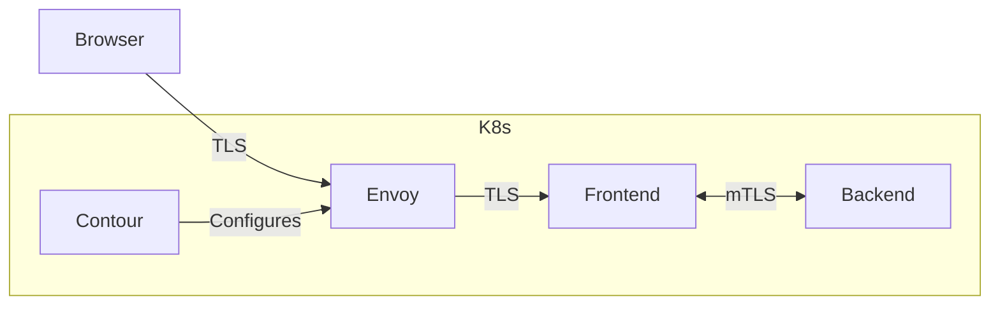

# Lab 1: Getting Hands on with PKI

## Introduction

In this lab you are going to get hands on with PKI by setting up a simple example with two services running in a local
[kind](https://kind.sigs.k8s.io/) cluster. A [frontend](./frontend) service will serve a simple web UI allowing visitors
to click a button and make a request to a [backend](./backend) service. The frontend and backend services are written in
[Go](https://go.dev/) and have been configured to communicate over mTLS. HTTPS certificates for our
[Envoy](https://www.envoyproxy.io) ingress to our frontend will be set up using [Contour](https://projectcontour.io/).



In order to learn more about PKI internals, you will first create all key material and certificates manually using
[CFSSL](https://github.com/cloudflare/cfssl). You will then see how projects such as
[cert-manager](https://cert-manager.io/) can automate the management of certificates and make our life easier!

## Step 1: Set up a Self-Signed Local PKI

You will use [CFSSL](https://github.com/cloudflare/cfssl) to create a local PKI consisting of a self-signed root Certificate Authority (CA) and an
intermediate CA which will sign your frontend, backend and ingress certificates.

Download CFSSL to the [bin](../bin) directory and add to your path as follows:

```bash
make cfssl
export PATH=../bin:$PATH
```

Create a new directory to hold certificates and key material, and `cd` to that directory:

```bash
mkdir certs && cd certs
```

Generate the certificate for your self-signed root CA:

```bash
cfssl gencert -initca ../pki-config/root.json | cfssljson -bare root
```

After you issue this `cfssl` command, you should see output similar to:

```log
2023/11/24 14:56:38 [INFO] generating a new CA key and certificate from CSR
2023/11/24 14:56:38 [INFO] generate received request
2023/11/24 14:56:38 [INFO] received CSR
2023/11/24 14:56:38 [INFO] generating key: rsa-4096
2023/11/24 14:56:39 [INFO] encoded CSR
2023/11/24 14:56:39 [INFO] signed certificate with serial number 510566395576246619559306285915771350604273698670
```

This output shows the creation steps of a new self-signed root CA using `cfssl`.

You can now use the following openssl command to decode the root CA's certificate:

```bash
openssl x509 -in root.pem -text -noout
```

Note that the `Issuer` and `Subject` fields are exactly the same, as this certificate is self-signed:

```txt
Certificate:
    Data:
        Version: 3 (0x2)
        Serial Number:
            0a:db:46:c2:6a:13:8d:94:c7:9b:2f:0d:ac:69:21:98:cd:d3:7c:d4
        Signature Algorithm: sha512WithRSAEncryption
        Issuer: C = UK, L = London, O = CostalContainers, OU = CostalContainers Root CA, CN = CostalContainers Root CA
        Validity
            Not Before: Sep  5 07:00:00 2023 GMT
            Not After : Sep  3 07:00:00 2028 GMT
        Subject: C = UK, L = London, O = CostalContainers, OU = CostalContainers Root CA, CN = CostalContainers Root CA
        ...................................................
        ...................................................
        ...................................................
```

Generate key material and a Certificate Signing Request (CSR) for your Intermediate CA, and submit the CSR to your root
CA for signing:

```bash
cfssl gencert -initca ../pki-config/intermediate.json | cfssljson -bare intermediate
cfssl sign -ca root.pem -ca-key root-key.pem \
  -config ../pki-config/profiles.json -profile intermediate_ca intermediate.csr | cfssljson -bare intermediate
```

Decode the Intermediate CA's certificate, and observe that the Issuer field corresponds to your Root CA, whilst the
Subject field corresponds to the Intermediate CA. Also note that since you specified the `intermediate_ca` profile
(as defined in the [profiles.json](pki-config/profiles.json) file), the key usage fields in the `X509v3 extensions`
include `Certificate Sign`, meaning that the key pair bound to the certificate (through the root CA's signature) can be
used to sign 'leaf certificates' further down the PKI. Leaf certificates are also known as 'end-entity certificates' and
key pairs associated with these certificates cannot be used to sign other certificates. Run the following command to
view the Intermediate CA certificate:

```bash
openssl x509 -in intermediate.pem -text -noout
```

You should see output which looks similar to the following:

```txt
Certificate:
    Data:
        Version: 3 (0x2)
        Serial Number:
            05:eb:22:69:9f:1e:fb:e7:5c:6c:46:d5:96:ba:ce:47:ba:28:a1:06
        Signature Algorithm: sha512WithRSAEncryption
        Issuer: C = UK, L = London, O = CostalContainers, OU = CostalContainers Root CA, CN = CostalContainers Root CA
        Validity
            Not Before: Sep  5 07:02:00 2023 GMT
            Not After : Sep  4 07:02:00 2024 GMT
        Subject: C = UK, L = London, O = CostalContainers, OU = CostalContainers Intermediate CA, CN = CostalContainers Intermediate CA
        Subject Public Key Info:
            Public Key Algorithm: rsaEncryption
                Public-Key: (4096 bit)
                Modulus:
                    00:e1:e7:ee:d7:d0:93:05:0f:70:b3:c7:d4:c7:4b:
                    .............................................
                Exponent: 65537 (0x10001)
        X509v3 extensions:
            X509v3 Key Usage: critical
                Digital Signature, Key Encipherment, Certificate Sign, CRL Sign
            X509v3 Extended Key Usage:
                TLS Web Server Authentication, TLS Web Client Authentication
            X509v3 Basic Constraints: critical
                CA:TRUE, pathlen:0
            X509v3 Subject Key Identifier:
                A6:18:9A:5D:DC:FF:8F:6A:4E:FC:55:6D:BB:3A:28:37:9A:5E:79:C9
            X509v3 Authority Key Identifier:
                2C:BC:F2:16:B8:1A:11:DE:0F:BE:5C:A8:E8:28:66:37:6D:C3:B0:90
    Signature Algorithm: sha512WithRSAEncryption
    Signature Value:
        a8:00:7a:00:b4:0f:ac:d5:66:6d:90:b7:f7:68:59:d0:6b:d6:
        ......................................................
```

In your example, you are going to generate leaf certificates which will be signed by your Intermediate CA, and used to
secure:

- inbound TLS connections from outside your Kubernetes cluster to the reverse proxy set up by your ingress controller
- a TLS connection between the reverse proxy and the frontend service
- a mutual TLS (mTLS) connection between the frontend and backend

As your architecture only involves a one-way TLS connection for ingress traffic to the cluster, you will generate a
`server` certificate for ingress (as defined in the [profiles.json](pki-config/profiles.json) file). However, you would like to implement
mTLS between services within the cluster, so you will use the `peer` profile for your frontend and backend services,
where this profile includes the `client auth` key usage in addition to the `server auth` usage which is present in the
`server` profile. Generate the leaf certificates using the following commands:

```bash
cfssl gencert -ca intermediate.pem -ca-key intermediate-key.pem \
  -config ../pki-config/profiles.json -profile=server ../pki-config/ingress.json | cfssljson -bare ingress

cfssl gencert -ca intermediate.pem -ca-key intermediate-key.pem \
  -config ../pki-config/profiles.json -profile=peer ../pki-config/frontend.json | cfssljson -bare frontend

cfssl gencert -ca intermediate.pem -ca-key intermediate-key.pem \
  -config ../pki-config/profiles.json -profile=peer ../pki-config/backend.json | cfssljson -bare backend
```

Build certificate chains linking back to the root for your three certificates:

```bash
cat ingress.pem >> ingress-cert-chain.pem
cat intermediate.pem >> ingress-cert-chain.pem
cat root.pem >> ingress-cert-chain.pem

cat frontend.pem >> frontend-cert-chain.pem
cat intermediate.pem >> frontend-cert-chain.pem
cat root.pem >> frontend-cert-chain.pem

cat backend.pem >> backend-cert-chain.pem
cat intermediate.pem >> backend-cert-chain.pem
cat root.pem >> backend-cert-chain.pem
```

Change back to the parent directory, where you will run the commands for the remainder of this lab:

```bash
cd ..
```

## Step 2: Build the Kubernetes Ingress Example

Create a [kind](https://kind.sigs.k8s.io) cluster:

```bash
kind create cluster --name pki --config kind/kind.yaml
```

Install [Contour](https://projectcontour.io/) as an ingress controller:

```bash
kubectl apply -f https://raw.githubusercontent.com/projectcontour/contour/release-1.26/examples/render/contour.yaml
```

Apply some patches to the Contour configuration as per the [kind documentation](https://kind.sigs.k8s.io/docs/user/ingress/#contour):

```bash
kubectl patch daemonsets \
  -n projectcontour envoy \
  -p '{
    "spec":{
      "template":{
        "spec":{
          "nodeSelector":{
            "ingress-ready":"true"
          },
          "tolerations":[{
            "key":"node-role.kubernetes.io/control-plane",
            "operator":"Equal",
            "effect":"NoSchedule"
          },{
            "key":"node-role.kubernetes.io/master",
            "operator":"Equal",
            "effect":"NoSchedule"
          }]
        }
      }
    }
  }'
```

As you initially created your key material and certificates manually using CFSSL for learning purposes, you will create
a namespace called `manual` to deploy your resources into:

```bash
kubectl create ns manual
```

If you look through the [frontend code](frontend/main.go) and observe the following lines within the `main` function:

```golang
server := &http.Server{
  Addr: ":8443",
}

log.Fatal(server.ListenAndServeTLS("/certs/frontend.pem", "/certs/frontend-key.pem"))
```

You can see that once the application is containerized, you will need to make the frontend certificate and private key
available in the `/certs` directory and name them accordingly (`frontend.pem` and `frontend-key.pem`). You will see how
to do this when you create a Kubernetes manifest defining your application deployment later on. Note also the
`makeHTTPRequest` function within the code, which is used to call the backend service when the button in the frontend
is clicked. Within this function, an HTTPS client is created which contains a TLS config with:

- the backend certificate chain PEM file (i.e. a file containing the backend certificate, intermediate certificate and
- root certificate in PEM format) so that the frontend (client) can verify the identity of the backend (server) and make
- an explicit trust decision.
- the frontend certificate and private key, which enables the backend (server) to verify the identity of the frontend
- (client), provided the backend has a similar certificate chain containing the frontend certificate on which it can
- base an explicit trust decision. Note that in more common one-way TLS requests, only the client validates the server,
- whereas you want the server to also verify the client in your mTLS case; server only verification of client is
- possible but far less common.

For now, build the frontend image and load it into the kind cluster:

```bash
docker build -f frontend/Dockerfile -t frontend-app:v1 ./frontend
kind load docker-image frontend-app:v1 -n pki
```

Create [secrets](https://kubernetes.io/docs/concepts/configuration/secret/) to hold private keys, certificates and certificate chains for ingress, frontend and backend:

```bash
kubectl create secret tls ingress-cert -n manual \
  --key=./certs/ingress-key.pem \
  --cert=./certs/ingress.pem

kubectl create secret generic frontend -n manual \
  --from-file=frontend.pem=./certs/frontend.pem \
  --from-file=frontend-key.pem=./certs/frontend-key.pem \
  --from-file=ca.crt=./certs/frontend-cert-chain.pem \
  --from-file=backend-cert-chain.pem=./certs/backend-cert-chain.pem

kubectl create secret generic backend -n manual \
  --from-file=backend.pem=./certs/backend.pem \
  --from-file=backend-key.pem=./certs/backend-key.pem \
  --from-file=frontend-cert-chain.pem=./certs/frontend-cert-chain.pem
```

Now that you have key material, certificates and certificate chains available in Kubernetes secrets within the `manual`
namespace, you can make this information available to your frontend container via a `volumeMount` as in the following
lines from the [frontend deployment](manifests/frontend.yaml):

```yaml
containers:
  - name: frontend-app
    image: frontend-app:v1
    ports:
      - containerPort: 8443
    volumeMounts:
      - mountPath: "/certs"
        name: frontend
        readOnly: true
volumes:
  - name: frontend
    secret:
      secretName: frontend
```

By inspecting the frontend secret with `kubectl describe secret frontend -n manual`, you can see that the secret
contains the following keys: `backend-cert-chain.pem`, `ca.crt`, `frontend-key.pem`, and `frontend.pem`. Your volume
mount will ensure that this information is present as four separate files within the `/certs` directory within the
container, as is required by the frontend Go code that you looked at earlier.

Create the frontend deployment and service, as well as an
[`HTTPProxy`](https://projectcontour.io/docs/1.26/config/fundamentals/) which tells Contour how to configure ingress
routing for your frontend service:

```bash
kubectl apply -f manifests/frontend.yaml
kubectl apply -f manifests/httpproxy.yaml
```

Take a look at the [HTTPProxy configuration](manifests/httpproxy.yaml) that you just applied:

```yaml
apiVersion: projectcontour.io/v1
kind: HTTPProxy
metadata:
  name: frontend
  namespace: manual
spec:
  virtualhost:
    fqdn: localhost
    tls:
      secretName: ingress-cert
  routes:
    - conditions:
      - prefix: /
      services:
        - name: frontend
          port: 443
          validation:
            caSecret: frontend
            subjectName: frontend
```

You will be accessing the frontend via ingress by navigating to `https://localhost` in your browser, hence the `fqdn`
value within the `virtualhost` configuration. Note that the `ingress-cert` secret you created is used for inbound TLS,
and the [ingress config file](pki-config/ingress.json) you used to create the ingress certificate also contains `localhost` in the `hosts`
section for the same reason. A separate TLS connection from the ingress reverse proxy to the frontend is specified by
including validation for the frontend service using the frontend secret. This secret contains a `ca.crt` key, whose
value is the frontend certificate chain.

Now that the frontend service is up and running, you can build and deploy your backend. Take a look at the
[backend code](backend/main.go), and note the `tlsConfig`:

```golang
tlsConfig := &tls.Config{
  ClientCAs:  caCertPool,
  ClientAuth: tls.RequireAndVerifyClientCert,
}
```

As the backend has access to the frontend certificate chain, the frontend (client) can be verified and an mTLS
connection can be established. Build the backend image and load it into the kind cluster:

```bash
docker build -f backend/Dockerfile -t backend-app:v1 ./backend
kind load docker-image backend-app:v1 -n pki
```

Create a backend deployment and service:

```bash
kubectl apply -f manifests/backend.yaml
```

Navigate to [https://localhost:8443/](https://localhost:8443/) in your browser, accept the certificate warning and click the `Make Request`
button to send a request from the frontend to the backend over an mTLS connection. Observe that the connection is
successful and a message is returned.

In the next part of the lab, you are going to use [cert-manager](https://cert-manager.io/) to automate the process of certificate creation
and management, so you need to delete all the resources in your `manual` namespace to allow us to redeploy the services
in such a way to get their key material and certificates from cert-manager:

```bash
kubectl delete ns manual
```

## Step 3: Automation using cert-manager

Install [cert-manager](https://cert-manager.io/) in your cluster:

```bash
kubectl apply -f https://github.com/cert-manager/cert-manager/releases/download/v1.13.1/cert-manager.yaml
```

You will create a namespace called `cm` to deploy your resources for this part of the lab into:

```bash
kubectl create ns cm
```

Create a self-signed issuer for the `cm` namespace in your cluster: **You may get an error calling the webhook if
cert-manager has not started yet, just wait a few minutes and try again**

```bash
kubectl apply -f cert-manager/config/ss-issuer.yaml
```

Use the self-signed issuer to create a self-signed certificate for your `cm` namespace's issuing CA:

```bash
kubectl apply -f cert-manager/config/cm-ca-cert.yaml
```

Create your `cm` namespace's issuing CA:

```bash
kubectl apply -f cert-manager/config/issuer-ca.yaml
```

Finally, create certificates for your ingress, frontend and backend services, which are signed by your `cm` namespace's
issuing CA:

```bash
kubectl apply -f cert-manager/config/certs.yaml
```

Note that Kubernetes secrets are created for `ingress`, `frontend` and `backend` by cert-manager:

```bash
kubectl get secrets -n cm
```

By running `kubectl describe secret <secret name> -n cm` for each of the secrets, you can see that each includes the
following:

- `ca.crt`: the CA certificate
- `tls.crt`: the TLS certificate for the service in question
- `tls.key`: the private key associated with the public key bound to the TLS certificate

Decode one of the certificates and observe that as cert-manager is managing and rotating certificates, the certificate
validity can be much shorter (90 days instead of 365 days):

```bash
kubectl get secret ingress -n cm -o jsonpath="{.data['tls\.crt']}" | base64 -d | openssl x509 -text -noout
```

Create a frontend deployment and service, as well as an [`HTTPProxy`](https://projectcontour.io/docs/1.26/config/fundamentals/) which tells Contour how to configure ingress
routing for your frontend service:

```bash
kubectl apply -f cert-manager/manifests-cm/frontend.yaml
kubectl apply -f cert-manager/manifests-cm/httpproxy.yaml
```

Create a backend deployment and service:

```bash
kubectl apply -f cert-manager/manifests-cm/backend.yaml
```

Once again, navigate to [https://localhost:8443/](https://localhost:8443/) in your browser, accept the certificate warning and click the
`Make Request` button to send a request from the frontend to the backend over an mTLS connection. Observe that the
connection is successful and a message is returned.

## Teardown

```bash
kind delete cluster -n pki
rm -rf certs
```
