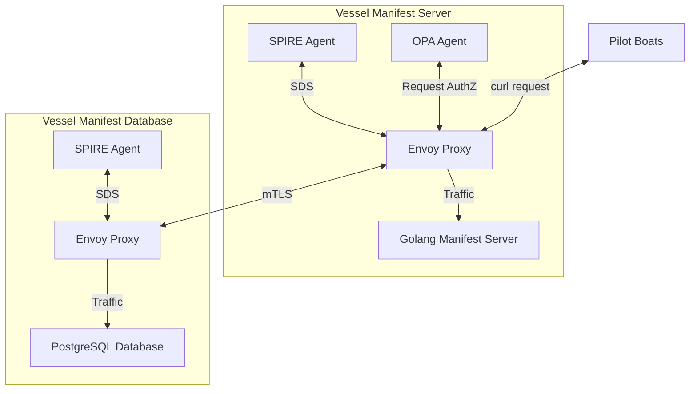

# Lab 7: Integrating SPIRE with OPA and Envoy

## Prerequisites

- A 64-bit Linux environment (AMD, Intel, or Arm).
- Basic familiarity with Kubernetes manifests and `kubectl` commands.

## Introduction

Ahoy, intrepid explorers of the digital ocean! 🏴‍☠️ Welcome to a journey where we navigate through the intricate waves of
Authentication (AuthN) and Authorization (AuthZ) with Coastal Containers Ltd. In this adventurous lab, we'll delve into
the depths of securing the vessel manifest system, ensuring that the treasures of data are safeguarded with the
formidable technologies of [Envoy Proxy](https://www.envoyproxy.io/) and
[Open Policy Agent (OPA)](https://www.openpolicyagent.org/).



In the charted course above, we visualize the integration of SPIRE, OPA, and Envoy to fortify the security of Coastal
Containers Ltd's vessel manifest system. Let's set sail and explore how these technologies intertwine to create a secure
harbor for our data:

### 🚢 Vessel Manifest Server

- **Golang Manifest Server:** The heart of our journey, where the vessel manifest data is stored and managed.
- **OPA Agent:** Our vigilant lookout, ensuring that only authorized requests can access the manifest server by
enforcing policies defined in Rego language.
- **Envoy Proxy:** The steadfast gatekeeper, managing and directing the traffic between the server and database,
ensuring secure communication via mTLS.
- **SPIRE Agent:** The trusted shipwright, providing SPIFFE Verifiable Identity Documents (SVIDs) to establish trust
between services in our system.
- **Pilot Boat(s):** Torchbearers and trusted navigators of Coastal Containers Fleet, pilot boats lead international
freighters through intrepid waters, and will serve as our test case issuing curl requests to the vessel manifest server.

### 🗃️ Vessel Manifest Database

- **PostgreSQL Database:** The treasure trove where all the precious vessel manifest data is securely stored.
- **Envoy Proxy:** Another loyal gatekeeper, safeguarding the database and ensuring only secure, encrypted traffic can
access the stored data.
- **SPIRE Agent:** Ensuring that the database service has a verifiable identity, providing SVIDs to establish mTLS with
the server.

### Anchoring the Technologies Together

- **SPIRE and Envoy:** SPIRE Agent uses the Secret Discovery Service (SDS) to provide SVIDs to Envoy, establishing a
secure identity and facilitating mTLS communication between the server and database.
- **OPA and Envoy:** OPA Agent intercepts requests to the server, consulting its policies to decide whether to allow
access. It communicates with Envoy to enforce these authorization decisions, ensuring only legitimate requests can sail
through to the manifest server.
- **Envoy Proxies Communication:** The two Envoy proxies manage the mTLS communication between the server and database,
ensuring that data transmitted across the services is secure and encrypted.

With the integration of SPIRE, OPA, and Envoy, Coastal Containers Ltd embarks on a journey where the vessel manifest
system is fortified with robust AuthN and AuthZ. SPIRE ensures that each service in the system can prove its identity,
OPA ensures that requests are scrutinized against policy to ensure they are authorized, and Envoy ensures that all
communication is securely encrypted with mTLS.

Join us in this lab as we navigate through the implementation and testing of this secure integration, ensuring that the
treasures of vessel manifest data are shielded from the marauding pirates of the digital sea! 🏴‍☠️🌊🔐

### Preparing Your Environment

Before you cast off, prepare your ships to sail by setting your working directory in
[lab-07-spire-opa](../lab-07-spire-opa) as an environment variable:

```bash
export LAB_DIR=$(pwd)
```

This will make issuing commands easier in the following steps of this exercise, and will reduce the possibility of
reference errors.

## Step-by-Step Instructions

### Step 1: Provision Infrastructure

To set sail, spin up the Kubernetes demo cluster using Kind by issuing the following `make` command while in the root
lab directory

```bash
make cluster-up
```

If your cluster is already running, you can skip this step and continue on with the lab.

### Step 2: Deploy SPIRE to the Cluster

Create the `spire` namespace and deploy the `spire-server`, `spire-agent`, `spiffe-csi-driver`, and create the initial
node registration entry:

```shell
make deploy-spire register-agent
```

If this completed as-expected, and SPIRE is deployed to your cluster, should see the output:

```log
SPIRE deployed on the cluster.
...
Entry ID         : 138d8eab-3b09-40d8-a531-bae10a9f2d4d
SPIFFE ID        : spiffe://coastal-containers.example/agent/spire-agent
Parent ID        : spiffe://coastal-containers.example/spire/server
Revision         : 0
X509-SVID TTL    : default
JWT-SVID TTL     : default
Selector         : k8s_psat:agent_ns:spire
Selector         : k8s_psat:agent_sa:spire-agent
Selector         : k8s_psat:cluster:kind-kind
```

### Step 3: Build and Load the Server Image

Build and load the vessel manifest server image by running:

```shell
make cluster-build-load-image DIR=workload/server
```

The vessel manifest `server` is the north star of our digital ship, steering the management and access of the vessel
data within our system. It's crafted using Golang and serves as a pivotal component in our architecture, acting as a
liaison between the user requests and the stored data in the PostgreSQL `database`.

**Key Responsibilities:**

- **API Endpoint Exposure:**
  - The server exposes various API endpoints that allow interaction with the vessel manifest data. These endpoints
  enable functionalities like fetching, creating, updating, and deleting vessel manifest records.

- **Data Management:**
  - It communicates with the PostgreSQL `database` to perform CRUD (Create, Read, Update, Delete) operations, ensuring
  that the data is accurately maintained and retrieved upon valid requests.

- **Request Handling:**
  - The server processes incoming HTTP requests, extracts necessary information, and performs the required operation,
  whether it be fetching data from or making modifications to the database.

**API Endpoints and Functionalities:**

- `GET /api/vessels`: Retrieve a list of all vessel manifests.
- `GET /api/vessels/{id}`: Retrieve the details of a specific vessel using its unique identifier.
- `POST /api/vessels`: Create a new vessel manifest record.
- `PUT /api/vessels/{id}`: Update the details of an existing vessel manifest.
- `DELETE /api/vessels/{id}`: Remove a vessel manifest record from the database.

By executing the `make cluster-build-load-image DIR=workload/server` command, we build the Docker image of our server
and load it into our kind cluster. This ensures that the server, with all its functionalities and integrations, is
packaged and ready to be deployed within our Kubernetes environment. If you would like to investigate the functionality
of the server workload, review the files contained within the [workload/server](./workload/server) directory.

In the subsequent steps, we'll navigate through deploying this server and ensuring that it sails smoothly within our
charted architecture map.

### Step 4: Create the Necessary Configmaps

In order to supply the vessel manifest `server` and `database` with the required Envoy and OPA configuration, we will
need to pass these files as Kubernetes configmaps.

For the vessel manifest `server`, we will need configmaps to store the [envoy.yaml](./config/server/envoy/envoy.yaml),
[opa-config.yaml](./config/server/opa/opa-config.yaml), and [opa-policy.rego](./config/server/opa/opa-policy.rego)
files. Functionally, we will be creating two configmaps for this purpose, `server-envoy` to hold the
[envoy.yaml](./config/server/envoy/envoy.yaml), and `opa-policy` to hold the
[opa-config.yaml](./config/server/opa/opa-config.yaml) / [opa-policy.rego](./config/server/opa/opa-policy.rego) files.

For the vessel manifest `database`, we will need a configmap to store the
[envoy.yaml](./config/database/envoy/envoy.yaml) file. Functionally, this proxy configuration will be stored in the
`database-envoy` configmap.


To begin, first create the `server-envoy` configmap for the vessel manifest server:

```shell
kubectl create configmap server-envoy --from-file=config/server/envoy/envoy.yaml
```

Next, create the `opa-policy` configmap for the vessel manifest server:

```shell
kubectl create configmap opa-policy --from-file=config/server/opa/opa-policy.rego \
  --from-file=config/server/opa/opa-config.yaml
```

*📝Note: The `opa-policy` configmap is used to hold both the [opa-config.yaml](./config/server/opa/opa-config.yaml) and
[opa-policy.rego](./config/server/opa/opa-policy.rego) files, passing them into the `server` via a mounted volume.*

After this, create the `database-envoy` configmap for the vessel manifest `database`:

```shell
kubectl create configmap database-envoy --from-file=config/database/envoy/envoy.yaml
```

These ConfigMaps will be mounted into the respective pods, providing the necessary configurations for Envoy and OPA to
operate effectively within our system. With these configurations in place, we ensure secure, policy-enforced
communication between our `server` and `database`.

Before we move on, however, it's important to first understand what the Envoy and OPA configuration is actually doing.

**Envoy Configuration:**

Envoy Proxy acts as a mediator in the communication between the `server` and `database`, ensuring secure and controlled
traffic flow. The configuration files, namely `envoy.yaml`, dictate how Envoy should manage the traffic, apply security
protocols, and interact with other services.

Some key components of these configuration files are:

- [**Listeners**](https://www.envoyproxy.io/docs/envoy/latest/configuration/listeners/listeners): Define how Envoy
should manage incoming connections.

```yaml
listeners:
    - name: local_proxy
      address:
        socket_address:
          address: 0.0.0.0
          port_value: 8081
```

Here, a listener named `local_proxy` is configured to listen to all incoming traffic on port `8081`.

- [**Clusters**](https://www.envoyproxy.io/docs/envoy/latest/api-v3/clusters/clusters): specify the services to which
Envoy should proxy the traffic.

```yaml
clusters:
  - name: database
    connect_timeout: 0.25s
    type: strict_dns
    lb_policy: ROUND_ROBIN
    load_assignment:
      cluster_name: database
      endpoints:
        - lb_endpoints:
            - endpoint:
                address:
                  socket_address:
                    address: postgres
                    port_value: 9001
```

A cluster named `database` is defined, which Envoy will use to discover the `database` service.

- [**TLS Context:**](https://www.envoyproxy.io/docs/envoy/latest/api-v3/extensions/transport_sockets/tls/v3/tls.proto#extensions-transport-sockets-tls-v3-upstreamtlscontext)
: Ensures mTLS communication between services, utilizing SVIDS (based on the registered SPIFFE
IDS) for secure identity verification.

```yaml
transport_socket:
  name: envoy.transport_sockets.tls
  typed_config:
    "@type": type.googleapis.com/envoy.extensions.transport_sockets.tls.v3.UpstreamTlsContext
    common_tls_context:
      tls_certificate_sds_secret_configs:
        - name: "spiffe://coastal-containers.example/app/manifest/server"
          sds_config:
            resource_api_version: V3
            api_config_source:
              api_type: GRPC
              transport_api_version: V3
              grpc_services:
                envoy_grpc:
                  cluster_name: spire_agent
      combined_validation_context:
        default_validation_context:
          match_typed_subject_alt_names:
            - san_type: URI
              matcher:
                exact: "spiffe://coastal-containers.example/app/manifest/database"
        validation_context_sds_secret_config:
          name: "spiffe://coastal-containers.example"
          sds_config:
            resource_api_version: V3
            api_config_source:
              api_type: GRPC
              transport_api_version: V3
              grpc_services:
                envoy_grpc:
                  cluster_name: spire_agent
```

This section configures the TLS settings to establish secure communication utilizing SPIRE for dynamic certificate
management. You can also notice the use of the SDS module within the `spire_agent` cluster for SVID handling.

**OPA Configuration:**

The [opa-config.yaml](./config/server/opa/opa-config.yaml) file defines how OPA should be configured within the system,
particularly regarding its interaction with Envoy for policy enforcement.

Key components of this configuration include:

- **[Decision Logs](https://www.openpolicyagent.org/docs/latest/management-decision-logs/):** Specifies where OPA should
log decision outputs.

```yaml
decision_logs:
  console: true
```

Here, decision logs are directed to the console for easy debugging and observation.

- **[Plugins](https://www.openpolicyagent.org/docs/latest/envoy-introduction/#what-is-opa-envoy-plugin):** Configures
the Envoy External Authorization gRPC server within OPA.

```yaml
plugins:
  envoy_ext_authz_grpc:
    addr: :8182
    query: data.envoy.authz.allow
```

OPA is configured to run the Envoy External Authorization gRPC server on port `8182` and to use the
`data.envoy.authz.allow` rule for making authorization decisions.

**OPA Policies:**

The [opa-policy.rego](./config/server/opa/opa-policy.rego) file contains the actual policy logic written in
[Rego language](https://www.openpolicyagent.org/docs/latest/policy-language/), which OPA will enforce.

Key components of this configuration include:

- **Default Deny:** Establishes that all requests are denied by default.

```rego
default allow := false
```

**Allow Rule:** Defines the conditions under which a request should be allowed.

```rego
allow {
    http_request.method == "GET"
    source_svid == "spiffe://coastal-containers.example/app/manifest/pilot-boat-0"
}
```

This rule allows requests that use the `GET` request method and originate from a service with the SPIFFE ID
`spiffe://coastal-containers.example/app/manifest/pilot-boat-0` (i.e. `pilot-boat-0`).

### Step 5: Deploy the Postgres Database

To create a registration entry and deploy the postgres vessel manifest database, run:

```shell
make deploy-database
```

If the `database` is up and running, you should see:

```log
Database workload deployed on the cluster.
```

This can also be verified by running:

```shell
kubectl get pods
```

The ouput of this command should show the running `postgres` pod, like shown here:

```log
NAME                        READY   STATUS    RESTARTS   AGE
postgres-67769c7cb6-b8pm5   2/2     Running   0          172m
```

### Step 6: Deploy the Server

Create a registration entry and deploy the vessel manifest server by running:

```shell
make deploy-server
```

If the `server` is up and running, you should see:

```log
Server workload deployed on the cluster.
```

This can also be verified by running:

```shell
kubectl get pods
```

The ouput of this command should show the running `server` and `postgres` pod, like shown here:

```log
NAME                        READY   STATUS    RESTARTS      AGE
postgres-67769c7cb6-gkvdz   2/2     Running   0             50s
server-6b5f6c6d69-66v4x     3/3     Running   2 (16s ago)   21s
```

Once this step complete, the vessel manifest server and database should be running with issued SVIDs. Assigned SVIDs are
created by the registration entry commands within the provided [Makefile](./Makefile), which works to register the
SPIFFE IDs:

- `spiffe://coastal-containers.example/app/manifest/server` for the server.
- `spiffe://coastal-containers.example/app/manifest/database` for the database.

### Step 7: Test Connections

With your demo architecture running and registered with SPIRE, we can test the OPA policies using `curl` containers
represented as 'pilot boat' workloads attempting to signal freighters by sending them `GET` requests. Per Coastal
Containers use-case, we must answer a few questions in order to prove the AuthZ policies are working as-expected.

- Can we issue a `GET` request to the vessel manifest `server` from `pilot-boat-0`?
- Can we issue a `GET` request to the vessel manifest `server` from `pilot-boat-1`?

To answer these questions, let's deploy both workloads.

First, we need to deploy their associated envoy configmaps:

```shell
kubectl create configmap pilot-boat-0-envoy --from-file=config/pilot-boat/pilot-boat-0/envoy/envoy.yaml
kubectl create configmap pilot-boat-1-envoy --from-file=config/pilot-boat/pilot-boat-1/envoy/envoy.yaml
```

Next, we can create the workloads by running:

```shell
make deploy-pilot-boat-0
make deploy-pilot-boat-1
```

Issue a `GET` request from `pilot-boat-0` to the server with:

```shell
kubectl exec -it pilot-boat-0 -c curl -- curl -v  -H "Accept: application/json" server/api/vessels
```

If it worked properly, you should see an output similar to this:

```log
*   Trying 10.96.39.5:80...
* Connected to server (10.96.39.5) port 80
> GET /api/vessels HTTP/1.1
> Host: server
> User-Agent: curl/8.4.0
> Accept: application/json
>
< HTTP/1.1 200 OK
< date: Thu, 30 Nov 2023 11:49:15 GMT
< content-length: 406
< content-type: text/plain; charset=utf-8
< x-envoy-upstream-service-time: 10
< server: envoy
<
[{"ID":1,"CreatedAt":"2023-11-30T11:48:54.280982Z","UpdatedAt":"2023-11-30T11:48:54.280982Z","DeletedAt":null,"Name":"Maritime Mover"},{"ID":2,"CreatedAt":"2023-11-30T11:48:54.297235Z","UpdatedAt":"2023-11-30T11:48:54.297235Z","DeletedAt":null,"Name":"Tidal Transporter"},{"ID":3,"CreatedAt":"2023-11-30T11:48:54.306254Z","UpdatedAt":"2023-11-30T11:48:54.306254Z","DeletedAt":null,"Name":"Cargo Clipper"}]
* Connection #0 to host server left intact
```

This output shows the list of created vessels that are owned and operated by Coastal Containers Ltd, along with various
operations performed on them (e.g. `CreatedAt` & `UpdatedAt`). Once the `curl` command completes, the exec function will
exit automatically.

You can view the opa decision log by executing the following command

```shell
kubectl logs -l=app=server -c opa | tail -1 | jq
```

If you cross reference the [opa-policy.rego](config/server/opa/opa-policy.rego), you can see `GET` request from
`pilot-boat-0` should be allowed, and this can be seen in the decision log.

```json
{
  "input": {
    "attributes": {
      "request": {
        "http": {
          "method": "GET"
        }
      },
      "source": {
        "principal": "spiffe://coastal-containers.example/app/manifest/pilot-boat-0"
      }
    }
  },
  "result": true
}

```

After this, run the following command to test if we can issue a `GET` request from `pilot-boat-1`:

```shell
kubectl exec -it pilot-boat-1 -c curl -- curl -v  -H "Accept: application/json" server/api/vessels
```

You should see the expected output:

```log
*   Trying 10.96.39.5:80...
* Connected to server (10.96.39.5) port 80
> GET /api/vessels HTTP/1.1
> Host: server
> User-Agent: curl/8.4.0
> Accept: application/json
>
< HTTP/1.1 403 Forbidden
< date: Thu, 30 Nov 2023 11:51:11 GMT
< server: envoy
< content-length: 0
< x-envoy-upstream-service-time: 9
<
* Connection #0 to host server left intact
```

This output indicates that the curl `GET` request was unsuccessful due to the policy defined in our
[opa-policy.rego](./config/server/opa/opa-policy.rego) file. The resulting AuthZ enforcement decision occurs due to the
fact that our rego policy will **ONLY** allow requests from the
`spiffe://coastal-containers.example/app/manifest/pilot-boat-0` SPIFFE ID registered to `pilot-boat-0`. As the `GET`
request was unsuccessful, the `curl` container gracefully terminated and deleted after
attempting this operation.

You can verify this by checking the opa decision log by executing the following command

```shell
kubectl logs -l=app=server -c opa | tail -1 | jq
```

The following truncated output shows that a `GET` request from `pilot-boat-1`is rejected.

```json
{
  "input": {
    "attributes": {
      "request": {
        "http": {
          "method": "GET"
        }
      },
      "source": {
        "principal": "spiffe://coastal-containers.example/app/manifest/pilot-boat-1"
      }
    }
  },
  "result": false
}

```

### Step 9: (Optional) Challenge Step

Your journey doesn’t end here, however! The sea of knowledge is vast and there’s always more to explore. For further
learning on OPA and AuthZ, navigate through the
[envoy-jwt-opa](https://github.com/spiffe/spire-tutorials/tree/main/k8s/envoy-jwt-opa) &
[envoy-opa](https://github.com/spiffe/spire-tutorials/tree/main/k8s/envoy-opa) demos in the
[spire-tutorials](https://github.com/spiffe/spire-tutorials/tree/main) GitHub repository. This repo provides additional
examples and scenarios for deploying SPIRE and integrating it peripheral tooling.

Additionally, you can try expanding on this demo by setting up more client workloads which send various CRUD requests
(e.g. `GET`, `PUT`, and `DELETE`) to the vessel manifest `server`. Issue a registration entry to create their SVIDs,
making sure to add them to an `allow` rule within the [opa-policy.rego](./config/server/opa/opa-policy.rego) file. Once
this is done, try testing your client's capabilities to issue various requests to the vessel manifest `server`. Can you
get it working, and are you able to issue requests from invalid SVIDs that aren't within the scope of the defined Rego
policy?

### Step 10: Cleanup

As the following lab exercises will use the same cluster, tear down the SPIRE setup and server/database workload
deployments from this lab by running:

```shell
cd $LAB_DIR && make tear-down
```

To tear down the entire Kind cluster, run:

```shell
cd $LAB_DIR && make cluster-down
```

## Conclusion

Bravo, Navigator! 🚢 You've successfully sailed through the intrepid waters of AuthZ by integrating SPIRE with Open
Policy Agent (OPA) and Envoy, thereby enhancing the security posture of Coastal Containers vessel manifest system with
policy enforcement.

Throughout the course of this hand-on exercise, you've learned and practically implemented the following:

- **SPIRE for Workload Identity:** You've explored how SPIRE provides a robust identity framework, assigning SPIFFE IDs
- to workloads and ensuring secure, identity-verified communication through mTLS.

- **OPA for Policy Enforcement:** You've witnessed the power of OPA in enforcing fine-grained, dynamic access control
- policies, ensuring that only authorized entities can access specific resources.

- **Envoy for Traffic Control:** You've utilized Envoy Proxy to manage and control the traffic between the vessel
- manifest server and database, ensuring that all communications are secure and policy-compliant.

- **Integration Magic:** You've integrated SPIRE, OPA, and Envoy, creating a secure, policy-enforced communication
- channel between the server and database, ensuring that only authorized, authenticated requests are allowed.

Your journey doesn’t end here, however! The sea of knowledge is vast and there’s always more to explore. For further
learning and to explore more examples, navigate through the
[SPIRE with Envoy and OPA](https://github.com/spiffe/spire-tutorials/tree/main/k8s/envoy-opa) tutorial on GitHub. This
repository provides additional examples and scenarios where SPIRE, Envoy, and OPA are utilized to secure communication
and enforce policies in for a sample frontend and backend app deployment.

May your future voyages in the vast ocean of cloud-native technologies be equally successful and enlightening! 🌊⚓️📘
