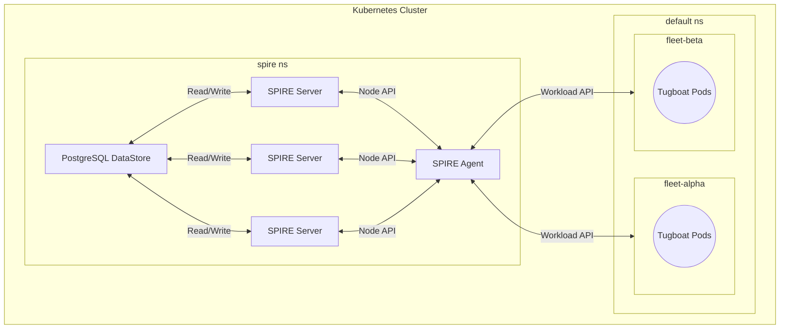

# Lab 9: Deploying SPIRE in High Availability Mode

## Prerequisites

- A 64-bit Linux environment (AMD, Intel, or Arm).
- Basic familiarity with Kubernetes manifests and `kubectl` commands.
- General understanding of `helm` commands is helpful.

## Introduction

Welcome to Coastal Containers Ltd., where the seamless management of tug boat fleets is paramount to ensuring the
efficient maneuvering of colossal freighters within bustling ports. In a world where security and availability are
pivotal, SPIRE (the SPIFFE Runtime Environment) sails to the rescue, ensuring our tug boats, represented by workloads
in our Kubernetes clusters, are continuously authenticated and authorized to communicate with the headquarters (HQ).
Please check out the architecture diagram below, which provides a simplified overview of the setup we will be looking to
deploy.



In this lab, we'll embark on a journey where two fleets, `fleet-alpha` and `fleet-beta`, will be deployed, each
representing a set of tug boats that need to authenticate themselves to the Coastal Containers Ltd. HQ. The HQ,
represented by three SPIRE servers (`spire-server-0`, `spire-server-1`, and `spire-server-2`), will issue SPIFFE
Verifiable Identity Documents (SVIDs) to authenticate each tug boat in the fleets, ensuring secure and trusted
communication channels, while maintaining high availability through a shared Postgres datastore.

### Preparing Your Environment

Before you cast off, prepare your ships to sail by setting your working directory in [lab-09-ha-mode](../lab-09-ha-mode)
as an environment variable:

```bash
export LAB_DIR=$(pwd)
```

This will make issuing commands easier in the following steps of this exercise, and will reduce the possibility of
reference errors.

## Step-by-Step Instructions

### Step 1: Provision Infrastructure

To set sail, spin up the Kubernetes demo cluster using Kind by issusing the following `make` command while in the root
lab directory:

```bash
make cluster-up
```

If your cluster is already running, you can skip this step and continue on with the lab.

### Step 2: Add the SPIRE Helm Repository

Add the SPIRE Helm repository to your Helm client:

```shell
make spire-add-helm-repo
```

If this operation is successful, you should see an update to the `spiffe` chart repository and the output:

```log
Update Complete. *Happy Helming!*
```

### Step 3: Deploy the Postgres Database

Deploy a Postgres database that will be used as a shared datastore by the SPIRE servers to ensure high availability:

```shell
make deploy-postgres
```

Alternative database solutions can be investigated within the
[SPIRE Server Configuration Reference](https://spiffe.io/docs/latest/deploying/spire_server/), and more specifically,
the [Server Plugin: DataStore "sql"](https://github.com/spiffe/spire/blob/v1.8.0/doc/plugin_server_datastore_sql.md)
documentation.

For the purposes of this demonstration, we will be using [PostgreSQL](https://www.postgresql.org/) due to its native
resilience and scalability.

### Step 4: Setup SPIRE with Helm

Deploy SPIRE using Helm, ensuring the SPIRE servers are configured for high availability and connected to the shared
Postgres datastore:

```shell
make spire-helm-install
```

If SPIRE deploys successfully, you should see an output similar to:

```log
Installing SPIRE using Helm...

NAME: spire
LAST DEPLOYED: Fri Oct  6 14:01:48 2023
NAMESPACE: spire
STATUS: deployed
REVISION: 1
NOTES:
Installed spire…

SPIRE installed using Helm.
```

*Note: SPIRE may take a few minutes to get running, so please be patient until all pods are running in the `spire`
namespace.*

Before we move on, let's dissect the [values.yaml](./values.yaml) file to understand the configuration that enables
SPIRE to operate in a high-availability mode:

```yaml
global:
  spire:
    clusterName: kind-kind
    trustDomain: coastal-containers.example
spire-server:
  replicaCount: 3
  ca_subject:
    country: UK
    organization: Coastal Containers Ltd.
    common_name: coastal-containers.example
  dataStore:
    sql:
      databaseType: postgres
      databaseName: spire
      host: spire-db
      port: 5432
      username: spire
      password: coastal-containers
      options:
        - sslmode: disable
```

**Global Configuration:**

- `clusterName`: The name of the K8s cluster, in this case it is `kind-kind` with our infrastructure setup.
- `trustDomain`: The trust domain for SPIFFE IDs, in this case it is `coastal-containers.example` per our scenario setup.

**SPIRE Server Configuration:**

- `replicaCount`: Number of replicas for the SPIRE Server, ensuring high availability. This is set to 2 for our purposes.
- `ca_subject`: Contains the CA subject information for generating self-signed certificates.
  - `country`: CA country name, set to UK for the Coastal Containers HQ.
  - `organization`: CA organization name, set to Coastal Containers Ltd. for our scenario.
  - `common_name`: CA common name, set to `coastal-containers.example` for our scenario setup.

**DataStore Configuration:**

- `sql`: Configurations for the SQL datastore.
  - `databaseType`: Type of the database, postgres will be used for our HA setup.
  - `databaseName`: Name of the database, `spire` for demo purposes.
  - `host`: Hostname or IP address of the database, this is set to `spire-db` - the name of our postgres kubernetes
  service.
  - `username`: Username for database access, set to `spire` for demo purposes.
  - `password`: Password for database access, set to `coastal-containers` for our scenario setup. *(In production, use
  secure mechanisms like encrypted secrets passed through an environment variable, e.g., ${DBPW}, instead of hard
  coding.)*
  - `options`: Additional options for the database connection, we simply disable SSl for demo purposes.

**High Availability Insights:**

- **Replica Count:** By setting `replicaCount` to `3`, we ensure three instances of the SPIRE Server are running,
providing redundancy and high availability.
- **DataStore:** Using a shared `postgres` datastore allows the SPIRE Server instances to maintain a synchronized state,
ensuring continuous operations even if one instance fails.

That's it! This step provides a detailed understanding of how the [values.yaml](./values.yaml) file configures SPIRE for
high availability and how the various components are interconnected. As always, make sure to always adhere to best
practices for managing sensitive data, especially in production environments.

📝Note: You can find a detailed break-down of the available SPIRE helm chart configuration via the
[values.yaml](https://github.com/spiffe/helm-charts/blob/main/charts/spire/values.yaml) manifest provided within the
official [SPIRE Helm Chart Repository](https://github.com/spiffe/helm-charts/tree/main/charts/spire).

### Step 5: View the Running Setup

With SPIRE up and running, we can now investigate the setup to see the deployed components and their configuration per
our specification in the [values.yaml](./values.yaml) file.

First, to view the SPIRE Server configuration, run the following:

```shell
make spire-view-server-config
```

Next, to view the SPIRE Agent configuration, run the following:

```shell
make spire-view-agent-config
```

These commands will output the set configurations within the respective `server.conf` and `agent.conf` files based on
our Helm chart deployment.

To investigate the Postgres database and ensure it is operating smoothly, run the following:

```shell
kubectl logs -l app=spire-db -n spire
```

### Step 6: Build and Deploy the Workloads

Now, with SPIRE up and running, we can deploy the `fleet-alpha` and `fleet-beta` workloads, which represent our tug boat
fleets. Before we deploy them, however, we must build the workload Docker image we will be using for their respective
deployments. To do this, navigate to the lab root directory and run:

```shell
cd $LAB_DIR
make cluster-build-load-image DIR=workload
```

This will create a Docker image with the tag `workload:latest` and load it into your kind cluster, which we will then
use to deploy `fleet-alpha` and `fleet-beta`. Next, to deploy the two 'fleet' workloads, run:

```shell
make deploy-fleets
```

If the workloads deployed as expected, you should see:

```log
Deploying tugboat fleet alpha...

/../../zero-trust-labs/ilt/lab-06-ha-mode/../bin/kubectl apply -f config/deploy-alpha.yaml
serviceaccount/fleet-alpha created
deployment.apps/fleet-alpha created

Tugboat fleet alpha deployed.
Deploying tugboat fleet beta...

/../../zero-trust-labs/ilt/lab-06-ha-mode/../bin/kubectl apply -f config/deploy-beta.yaml
serviceaccount/fleet-beta created
deployment.apps/fleet-beta created

Tugboat fleet beta deployed.
```

Each tug boat fleet uses a simple [go-spiffe](https://github.com/spiffe/go-spiffe) workload image which watches for
X509-SVID updates and outputs them in PEM format. This setup is based on the
[spiffe-watcher](https://github.com/spiffe/go-spiffe/tree/main/v2/examples/spiffe-watcher) example.

### Step 7: Check SPIRE Server Registration Entries

With the provided Helm chart deployment, the two SPIRE Servers will automatically attest the fleet workloads and assign
SVIDs via the [SPIRE Controller Manager](https://github.com/spiffe/spire-controller-manager). Before we move on, let's
dive a little deeper into what the [SPIRE Controller Manager](https://github.com/spiffe/spire-controller-manager) is and
how it helps us.

#### SPIRE Controller Manager

In a high-availability SPIRE deployment like the one you're working through in this lab, managing and rotating SPIFFE
Verifiable Identity Documents (SVIDs) is a fundamental operation to ensure the continuity and security of workload
communications. This is where the SPIRE Controller Manager comes into play.

The SPIRE Controller Manager serves as a bridge between your Kubernetes environment and the SPIRE Server, facilitating
the automatic registration of workloads and the establishment of federation relationships. It manages the lifecycle of
SVIDs, ensuring that they are issued, renewed, and rotated as necessary, in alignment with the
[SPIFFE specification](https://spiffe.io/docs/latest/spiffe-about/overview/). Functionally, the SPIRE Controller Manager
works through multiple custom resources and reconciliation processes (outlined below) to provide automated management of
SVIDs.

- **Custom Resources**:
  - **`ClusterSPIFFEID`**: Describes the identity shape applied to workloads and selectors identifying the applicable
  workloads. The SPIRE Controller Manager watches this resource for updates. Upon deployment, the
  `spire-controller-manager-service-account-based` `ClusterSPIFFEID` is automatically created.
  - **`ClusterStaticEntry`**: Declares static SPIRE registration entries, generally for workloads outside the Kubernetes
  cluster but within the trust domain.
  - **`ClusterFederatedTrustDomain`**: Describes a federation relationship for the cluster.

- **Reconciliation**:
  - **Workload Registration**: Triggered when changes on Pods, `ClusterSPIFFEID`, or `ClusterStaticEntry` resources are
  detected, ensuring SPIRE entries match the declared state.
  - **Federation**: Triggered when changes on `ClusterFederatedTrustDomain` resources are detected, ensuring SPIRE
  federation relationships match the declared state.

The SPIRE Controller Manager is designed to be deployed within the same pod as the SPIRE Server, communicating via a
private Unix Domain Socket in a shared volume. By default, the
[SPIRE Helm Chart](https://github.com/spiffe/helm-charts/tree/main/charts/spire) applies configuration settings for
deploying the SPIRE Controller Manager alongside the SPIRE Server. As the provided [values.yaml](./values.yaml) file for
this lab relies on the default configuration for the `controllerManager`, we've provided a simple `values.yaml` manifest
snippet on how to declaratively enable the SPIRE Controller Manager:

```yaml
spire-server:
  enabled: true
  controllerManager:
    enabled: true
```

For a more in-depth demonstration of how the SPIRE Controller Manager works, consult the documented
[demo](https://github.com/spiffe/spire-controller-manager/tree/main/demo) located on the
[spire-controller-manager](https://github.com/spiffe/spire-controller-manager) repository. Once you're comfortable with
your knowledge of the SPIRE Controller Manager, let's move on to the next steps of this exercise.

In order to verify the registration entries were created, we can check each SPIRE Server.

First, verify the registration entries within `spire-server-0`, by running:

```shell
kubectl exec -n spire spire-server-0 -- /opt/spire/bin/spire-server entry show
```

The output of these commands should show registration entries for the `spire-server` (3), `spiffe-csi-driver`,
`spire-agent`, and `fleet-alpha` (5) / `fleet-beta` (5) workload deployments.

Keep in mind that the structure of assigned SPIFFE IDs will follow the default K8s URI schema shown below:

`spiffe://coastal-containers.example/ns/{namespace}/sa/{serviceaccount}`

Five SVIDs will have been created for both the `fleet-alpha` and `fleet-beta` workloads given the number of replicas in
each deployment. This is the expected and desired outcome.*Note: These registration entries will be reflected within the
two other SPIRE Server instances as well, and can be verified by the same command using `spire-server-1` and
`spire-server-2`*

### Step 8: Investigate Fleet Deployments

To dive even deeper, you can explore the logs of the `fleet-alpha` and `fleet-beta` deployments to observe the issued
SVIDs.

Inspect `fleet-alpha` by running:

```shell
kubectl logs -f deployment/fleet-alpha
```

Inspect `fleet-beta` by running:

```shell
kubectl logs -f deployment/fleet-beta
```

Alternatively, you can inspect each individual tug boat pod by running:

```shell
kubectl logs -f fleet-<name>-<podid>
```

If everything is working properly, you will see an outputted SVID in PEM format that looks similar to this:

```log
-----BEGIN CERTIFICATE-----
MIIDJjCCAg6gAwIBAgIQU6rttK6HtG5KnqGuP9OW1DANBgkqhkiG9w0BAQsFADBU
MQswCQYDVQQGEwJVSzEgMB4GA1UEChMXQ29hc3RhbCBDb250YWluZXJzIEx0ZC4x
IzAhBgNVBAMTGmNvYXN0YWwtY29udGFpbmVycy5leGFtcGxlMB4XDTIzMTAwNjE4
NDU0OVoXDTIzMTAwNjIyNDU1OVowSDELMAkGA1UEBhMCVVMxDjAMBgNVBAoTBVNQ
SVJFMSkwJwYDVQQtEyAwZGNjZmEwOTNlNjFmZWVkNzUyNzllNzM0M2FhYWJlNzBZ
MBMGByqGSM49AgEGCCqGSM49AwEHA0IABEtJnJ0UAcamPt/G91i6pUSTSWwtG0C4
mREnyBKIi08zJdNtSTWU2RQwBrVfp4ZQS0ZV+KyW9fi61eSrZyx0MUmjgcowgccw
DgYDVR0PAQH/BAQDAgOoMB0GA1UdJQQWMBQGCCsGAQUFBwMBBggrBgEFBQcDAjAM
BgNVHRMBAf8EAjAAMB0GA1UdDgQWBBT0dXY49uK3gVD7qw8uWFgp9cYs/zAfBgNV
HSMEGDAWgBRhGyRyDhionv6w4AayIYbRgqDwBDBIBgNVHREEQTA/hj1zcGlmZmU6
Ly9jb2FzdGFsLWNvbnRhaW5lcnMuZXhhbXBsZS9ucy9kZWZhdWx0L3NhL2ZsZWV0
LWFscGhhMA0GCSqGSIb3DQEBCwUAA4IBAQAO0Kkx6ogTGnqB/CBnQUi4k442smgl
DI0yHxKRT1dtQkkMaj+V436bP9aC8rSzdyAqLxktapxMrPVmk85vWxuI9Lj9giq6
EhOkAWWBrANgni4YYrh5o2TaMJthS42OW6eBpi08JNSszodCjVf8kY4gCVDydhLN
MVxbZokCrX+lXSnBX/azztTga2fF6ZNgRDV6smpiZLM+uVVUIQrq1bHn4Ujmwdza
z+qFtOiqs2rEERBfdqHfK3ByvwP18lGLphsvFiCIeAdzHNAWMEPrUUotF1EK08hu
18YJxC4ZaweZdRjgajsmYDI2YXCC7MqRJZuLTP8HpUwcCiW7WSuEnedT
-----END CERTIFICATE-----
```

### Step 9: Cleanup

As the following lab exercises will use the same cluster, uninstall SPIRE using helm and tear down workload deployments
from this lab by running:

```shell
cd $LAB_DIR
helm uninstall spire
make tear-down
```

To tear down the entire Kind cluster, run:

```shell
cd $LAB_DIR && make cluster-down
```

## Conclusion

Congratulations, Captain! 🚢 You've successfully navigated through the deployment of SPIRE in a high-availability mode,
ensuring that the Coastal Containers Ltd. HQ can authenticate its tug boat fleets (`fleet-alpha` and `fleet-beta`) even
in the face of partial system failures.

Your journey involved deploying SPIRE servers with a shared Postgres datastore, ensuring that if one server encounters
turbulent waters, the other can seamlessly take over, ensuring no disruption in issuing SVIDs to the fleets. The tug
boats, represented by Kubernetes pods, continuously receive their rotated SVIDs, ensuring secure and authenticated
communication with the HQ.

## Final Considerations: Cert Manager Setup

Cert Manager is an extensible X.509 certificate controller made for Kubernetes and OpenShift workloads. Fundamentally,
cert-manager works to manage the automated issuance and renewal of certificates, thereby helping to build Public Key
Infrastructure (PKI) by securing ingress and pod-to-pod communication. As cert-manager operates based on custom
`certificate` and `issuer` resources within K8s, it is scalable and extensible by nature. Due to this, cert-manager can
be considered as an supplemental tool when setting up SPIRE in high availability mode. Namely, cert-manager can be
deployed as a shared root authority (via the
[UpstreamAuthority](https://github.com/spiffe/spire/blob/v1.7.2/doc/plugin_server_upstreamauthority_cert_manager.md)
plugin), which distributes intermediate certificates to each SPIRE Server instance.

For those looking to further secure their SPIRE architecture by integrating [cert-manager](https://cert-manager.io/) as
an upstream CA, consider the following snippet in your `values.yaml` for the SPIRE Helm chart:

```yaml
  upstreamAuthority:
    certManager:
      enabled: true
      issuerName: "spire-server-ca"
      issuerKind: "Issuer"
      issuerGroup: "cert-manager.io"
      namespace: "cert-manager"
```

*Note: Make sure to tailor this manifest configuration to your cert-manager setup and assigned
[issuers](https://cert-manager.io/docs/concepts/issuer/).*
