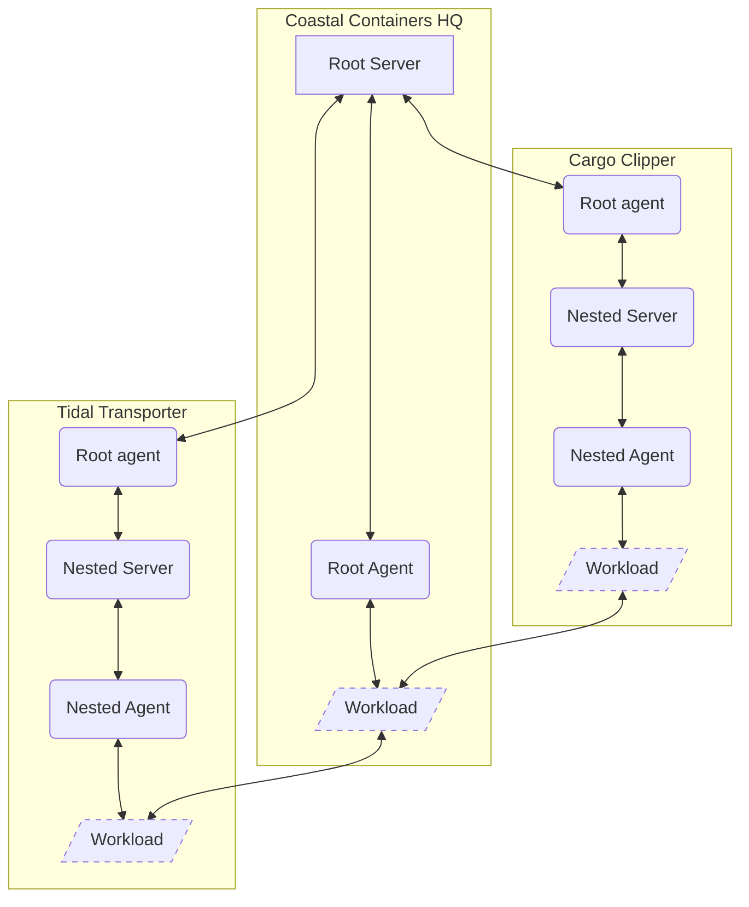

# Lab 10: Advanced Configuration 1 - Nested SPIRE

## Prerequisites

- A AMD, Intel, or Arm 64-bit Linux environment.
- Familiarity with Kubernetes manifests and `kubectl` commands is helpful.

## Introduction

Ahoy there, sailor! Welcome aboard to the course on Nested SPIRE Configuration, where we'll embark on an exciting
journey deep into the heart of Coastal Containers Ltd's trust domains. In this adventure, you'll discover how to set up
a nested SPIRE configuration that connects Coastal Containers HQ with its prized vessels, the Tidal Transporter and the
Cargo Clipper.

Picture this: the Tidal Transporter and the Cargo Clipper, two magnificent vessels, may find themselves navigating
treacherous waters, occasionally offline for extended periods of time. Yet, even in the midst of these maritime
challenges, it is paramount that they continue to mind their Secure Verifiable Identity Documents (SVIDs) faithfully and
operate seamlessly in a delegated manner.

Our mission is clear: we shall ensure that these vessels can issue and maintain trust, even when they're sailing solo in
the vast expanse of the open sea. Moreover, when the time comes for them to reunite and avoid potential collisions with
the unforgiving rocks of uncertainty, our trusty nested SPIRE configuration will ensure that they recognize each other
as allies and not fall prey to deceptive pirates lurking in the shadows.

So, hoist the anchor, set your course, and prepare to delve into the intricacies of nested SPIRE configuration, where
trust and safety shall prevail, even on the high seas!



### Preparing Your Environment

Before you cast off, prepare your ship to sail by setting up your working environment. If you haven't yet done so, make
sure you've cloned the lab repository to your local system. After that, you'll be working from the
[lab-10-nested-spire](../lab-10-nested-spire) directory.

```bash
export LAB_DIR=$(pwd)
export PATH=$PATH:$(pwd)/../bin
```

## Step-by-Step Instructions

### Step 1: Boot the Kubernetes clusters

You will need three Kubernetes clusters:

- **Coastal Containers HQ** This is the on shore HQ resident in the UK.
- **Cargo Clipper** This is one of the fleet of ships that carry cargo between the UK and US.
- **Tidal Transporter** This is one of the fleet of ships that carry cargo between the UK and Europe.

So first be sure to tear down any existing kind clusters before this step.

```shell
make clusters-up
```

Check all of the clusters are running correct with the following command

```shell
for i in coastal-containers cargo-clipper tidal-transporter
do
  kubectl --context=kind-$i get po -A
done
```

If you run into issues with pods starting on any of the clusters with logs referring to "too many open files" see
[this](https://kind.sigs.k8s.io/docs/user/known-issues/#pod-errors-due-to-too-many-open-files) known issue and update
your system.

### Step 2: Deploy the root SPIRE service on the Coastal Containers HQ

```shell
make deploy-root-spire
```

Note from the configuration in the
[configuration](../lab-10-nested-spire/manifests/spire-server-config-coastal-containers.yaml) file, the root SPIRE
server is deployed on the `coastal-containers.example` trust domain, and supports use of the
[join-token](https://spiffe.io/docs/latest/deploying/configuring/#join-token) attestor that we'll use in a minute to
issue SVIDs to the Tidal Transporter and the Cargo Clipper's remote root agents.

### Step 3: Prepare the trust relationships between the root SPIRE server and the nested root SPIRE agents

First create a join token on the root SPIRE server and store it as secrets in the Cargo Clipper and Tidal Transporter's
clusters by running:

```shell
kubectl --context=kind-tidal-transporter create secret \
  generic spire-root-join-token \
  -n spire \
  --from-literal=join-token="$(kubectl --context=kind-coastal-containers exec -ti -n spire spire-server-0 \
  -c spire-server -- /opt/spire/bin/spire-server token generate \
  -spiffeID spiffe://coastal-containers.example/tidal-transporter/root-agent -output json | jq -r .value)"

kubectl --context=kind-cargo-clipper create secret \
  generic spire-root-join-token \
  -n spire \
  --from-literal=join-token="$(kubectl --context=kind-coastal-containers exec -ti -n spire spire-server-0 \
  -c spire-server -- /opt/spire/bin/spire-server token generate \
  -spiffeID spiffe://coastal-containers.example/cargo-clipper/root-agent -output json | jq -r .value)"
```

Next, you'll need to let the root SPIRE server know about the nested root SPIRE servers so the agent will be able to
issue SVIDs. Do this by running:

```shell
kubectl --context=kind-coastal-containers exec -n spire spire-server-0 -c spire-server -- \
  /opt/spire/bin/spire-server entry create \
  -downstream \
  -parentID spiffe://coastal-containers.example/tidal-transporter/root-agent \
  -spiffeID spiffe://coastal-containers.example/tidal-transporter/server \
  -selector k8s:ns:spire \
  -selector k8s:sa:spire-server

kubectl --context=kind-coastal-containers exec -n spire spire-server-0 -c spire-server -- \
  /opt/spire/bin/spire-server entry create \
  -downstream \
  -parentID spiffe://coastal-containers.example/cargo-clipper/root-agent \
  -spiffeID spiffe://coastal-containers.example/cargo-clipper/server \
  -selector k8s:ns:spire \
  -selector k8s:sa:spire-server
```

### Step 4: Deploy the nested root SPIRE agents

Now you can deploy the nested spire agents by issuing:

```shell
kubectl --context=kind-tidal-transporter apply -f manifests/spire-agent-nested-root-agent.yaml
kubectl --context=kind-cargo-clipper apply -f manifests/spire-agent-nested-root-agent.yaml
```

Then you must wait for them to be ready before proceeding:

```shell
kubectl --context=kind-tidal-transporter -n spire wait --timeout=300s --for=condition=Ready pod -l app=spire-root-agent
kubectl --context=kind-cargo-clipper -n spire wait --timeout=300s --for=condition=Ready pod -l app=spire-root-agent
```

### Step 5: Deploy the nested SPIRE servers on the Tidal Transporter and the Cargo Clipper

After the previous wait conditions are met, you can deploy the nested SPIRE Servers by running:

```shell
make deploy-nested-spires
```

Note the configuration of the nested servers in the
[configuration](../lab-10-nested-spire/manifests/spire-server-config-cargo-clipper.yaml) file includes an
[UpstreamAuthority](https://github.com/spiffe/spire/blob/v1.8.0/doc/plugin_server_upstreamauthority_spire.md)
(shown below).

```ini
UpstreamAuthority "spire" {
  plugin_data = {
    server_address      = "coastal-containers-control-plane"
    server_port         = 8081
    workload_api_socket = "/run/spire/sockets/root-agent.sock"
  }
}
```

### Step 6: Deploy the workload

To test the nested SPIRE deployment, we will use the manifest server / client workloads deployed in
[lab-04-getting-svids](../lab-04-getting-svids). In this setup, however, the
[manifest server](./workload/server) will be deployed to the `kind-coastal-containers` cluster and the
[clients](./workload/client) to the `kind-tidal-transporter` / `kind-cargo-clipper` clusters. Deploy the workloads by
running:

```shell
make deploy-workloads
```

Once that has run, and the workloads are deployed, fetch the manifest client logs on the `kind-tidal-transporter`
cluster by running:

```shell
kubectl --context=kind-tidal-transporter logs deployments/client
```

This should result in an output detailing the `spiffe-helper` connection process and receipt of the shipping manifest as
shown below:

```log
time="2023-12-05T21:32:10Z" level=info msg="Using configuration file: \"/opt/spire/config/helper.conf\"\n" system=spiffe-helper
time="2023-12-05T21:32:10Z" level=info msg="Connecting to agent" agent_address=/spire-agent-socket/agent.sock system=spiffe-helper
time="2023-12-05T21:32:11Z" level=info msg="Received update" spiffe_id="spiffe://coastal-containers.example/tidal-transporter/manifest/workload/client" system=spiffe-helper
time="2023-12-05T21:32:11Z" level=info msg="Updating certificates" system=spiffe-helper
Received ship manifest: {'ship_name': 'SS Coastal Carrier', 'departure_port': 'London Gateway', 'arrival_port': 'Port Elizabeth', 'cargo': [{'type': 'electronics', 'quantity': 1000}, {'type': 'clothing', 'quantity': 2000}, {'type': 'food', 'quantity': 3000}]}
```

Similarly, you can check the logs of the client deployed to the `kind-coastal-clipper` cluster by running:

```shell
kubectl --context=kind-cargo-clipper logs deployments/client
```

This will result in an output detailing the `spiffe-helper` connection process and receipt of the shipping manifest as
shown below:

```log
time="2023-12-05T21:32:08Z" level=info msg="Using configuration file: \"/opt/spire/config/helper.conf\"\n" system=spiffe-helper
time="2023-12-05T21:32:08Z" level=info msg="Connecting to agent" agent_address=/spire-agent-socket/agent.sock system=spiffe-helper
time="2023-12-05T21:32:09Z" level=info msg="Received update" spiffe_id="spiffe://coastal-containers.example/cargo-clipper/manifest/workload/client" system=spiffe-helper
time="2023-12-05T21:32:09Z" level=info msg="Updating certificates" system=spiffe-helper
Received ship manifest: {'ship_name': 'SS Coastal Carrier', 'departure_port': 'London Gateway', 'arrival_port': 'Port Elizabeth', 'cargo': [{'type': 'electronics', 'quantity': 1000}, {'type': 'clothing', 'quantity': 2000}, {'type': 'food', 'quantity': 3000}]}
```

If you've got everything working, you should now see the client workloads running on the Tidal Transporter and Cargo
Clipper clusters, while the server runs on the Coastal Containers HQ cluster.The logs will show they're all able to
exchange ship manifests and establish mutual trust with the help of the `spiffe-helper` utility.

### Step 7: Cleanup

Now that you've proved everything works, its time to scrub the decks and delete your clusters:

```shell
cd $LAB_DIR && make clusters-down
```

## Conclusion

As we approach the end of this captivating voyage through the world of Nested SPIRE Configuration, it's time to reflect
on the knowledge and skills you've acquired during our journey. You've navigated the intricate waters of Coastal
Containers Ltd, Coastal Containers HQ, and their prized vessels, the Tidal Transporter and the Cargo Clipper, all while
safeguarding the integrity of Secure Verifiable Identity Documents (SVIDs) and ensuring seamless, delegated trust.

In our time together, you've learned how to forge trust connections that endure, even when the seas are rough, and
vessels may be offline. You've mastered the art of issuing trust and enabling secure communication among key
stakeholders, ensuring the safety and reliability of your maritime operations.

Remember, the lessons you've gleaned in this course extend beyond the realm of Nested SPIRE Configuration. They serve as
a testament to the importance of trust, reliability, and collaboration in the face of adversity. Whether you find
yourself in the heart of a turbulent sea or navigating the complexities of the digital world, the principles you've
honed here will serve as your guiding star.

As you set sail on your future adventures, armed with the knowledge and expertise gained in this course, know that you
have the power to avoid the rocks of deception and chart a course toward success and security. Always keep your SVIDs
close at hand, your trust well-placed, and your spirit resilient.

Fair winds and following seas, brave sailors! May your journeys be safe, and your trust remain unwavering.
Congratulations on completing the Nested SPIRE Configuration course, and may your future endeavors be filled with smooth
sailing and trusted connections.
