# Lab 12: Day Two Operations for SPIRE

## Prerequisites

- A 64-bit Linux environment (AMD, Intel, or Arm).
- Basic familiarity with Kubernetes manifests and `kubectl` commands.
- General understanding of Helm charts and `helm` commands is helpful.

## Introduction

Ahoy, Captain! 🚢 Welcome back aboard the Coastal Container crew. As we sail the vast digital seas, our mission is clear: to keep our ships afloat and ensure the smooth sailing of our simulated 'production' SPIRE deployment. Now, ye might be wondering, "What be this SPIRE ye speak of?" Well, let me regale ye with a tale.

In the treacherous waters of the digital realm, Coastal Containers Ltd seeks to establish trust and identity for its shipping services. To achieve this, we've anchored our trust in the [SPIFFE and SPIRE](https://spiffe.io/) project to provide secure identities to our wave-bound freighter vessels. In particular, this demo will be implementing the [SPIRE Helm Chart Production example](https://github.com/spiffe/helm-charts/tree/main/examples/production) as a baseline for our deployment. But be warned, sailor! While our scenario is based on this fine example, it doesn't reflect the true depths of a production environment. In a real production setup, you would likely need to setup [OIDC](https://openid.net/developers/how-connect-works/), an intemerdiary CA (such as [cert-manager](https://cert-manager.io/)), and more. But, for the purposes of this demo, we will be focusing on a simulated 'production' environment which runs on a Kubernetes cluster, deploys SPIRE in a hardened configuration via the [spire Helm chart](https://github.com/spiffe/helm-charts/tree/main/charts/spire), using [Prometheus](https://prometheus.io/) + [Grafana](https://grafana.com/) for monitoring, and [Tornjak](https://github.com/spiffe/tornjak) for SPIRE management. To help ye navigate the fleet, here is a charted graph of our setup:

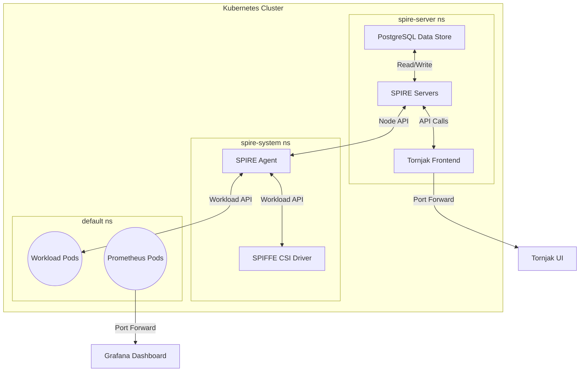

Within this architecture, SPIRE is deployed in high availability mode with 3 replica `spire-server`s and a shared [PostgreSQL Data Store](https://github.com/spiffe/spire/blob/main/doc/plugin_server_datastore_sql.md#database_type--postgres), for more about this implementation, check-out our [lab-6-ha-mode](../lab-6-ha-mode/) lab which walks through how to setup SPIRE in high availability mode. In order to simulate day two operations, your environment will be monitored with [Grafana dashboards](https://grafana.com/grafana/dashboards/) using [Prometheus metrics](https://prometheus.io/docs/concepts/metric_types/) as a data source and managed through a combination of [Tornjak](https://github.com/spiffe/tornjak), [kubectl](https://kubernetes.io/docs/reference/kubectl/), and [spire-server cli commands](https://github.com/spiffe/spire/tree/main/cmd/spire-server/cli).

### Preparing Your Environment

Before you cast off, prepare your ship to sail by setting up your working environment. If you haven't yet done so, make sure you've cloned the lab repository to your local system. After that, you'll be working from the
[lab-12-day-two](../lab-12-day-two/) directory.

```bash
export LAB_DIR=$(pwd)
```

## Step-by-Step Instructions

### Step 1: Provision Infrastructure

Run the following command in the [lab-12-day-two](../lab-12-day-two/) directory to setup the necessary infrastructure, including [cert-manager](https://github.com/cert-manager/cert-manager), [contour](https://github.com/projectcontour/contour) and a self signed CA:

```shell
make cluster-up
```

You can skip this step if you have already setup the cluster.

### Step 2: Add the Necessary Helm Chart Repositories

Add the SPIRE and Prometheus Helm repositries to your Helm client:

```shell
make add-helm-repos
```

If this operation is successful, you should see that the `prometheus-community` & `spiffe` repositories have been added, as shown in the expected output below:

```log
Adding the prometheus-community and spiffe helm repositories...

"prometheus-community" has been added to your repositories
"spiffe" has been added to your repositories
Hang tight while we grab the latest from your chart repositories...
...Successfully got an update from the "spiffe" chart repository
...Successfully got an update from the "prometheus-community" chart repository
Update Complete. ⎈Happy Helming!⎈

Helm repositories added.
```

You can view the current list of added Helm repositories by running:

```shell
helm repo list
```

This should return an output showing the recently added repositories, as seen in the expected output below:

```log
NAME                    URL
spiffe                  https://spiffe.github.io/helm-charts/
prometheus-community    https://prometheus-community.github.io/helm-charts
```

With the necessary Hem chart repositories added, we can now move onto installing the the helm charts to our cluster.

## Step 3: Deploy Prometheus via Helm

First, install Prometheus to the Kind cluster by running:

```shell
make prometheus-helm-install
```

The expected output is:

```log
Installing Prometheus using Helm...

NAME: prometheus
LAST DEPLOYED: Tue Oct 17 17:34:46 2023
NAMESPACE: default
STATUS: deployed
REVISION: 1
NOTES:
kube-prometheus-stack has been installed. Check its status by running:
  kubectl --namespace default get pods -l "release=prometheus"

Visit https://github.com/prometheus-operator/kube-prometheus for instructions on how to create & configure Alertmanager and Prometheus instances using the Operator.

Prometheus installed using Helm.
```

This command deploys the [kube-prometheus-stack](https://github.com/prometheus-community/helm-charts/tree/main/charts/kube-prometheus-stack#kube-prometheus-stack) chart, which is a collection of K8s manifests, [Grafana dashboards](https://grafana.com/grafana/dashboards/), and [Prometheus rules](https://prometheus.io/docs/prometheus/latest/configuration/recording_rules/) which provide end-to-end Kubernetes cluster monitoring using the [Prometheus Operator](https://github.com/prometheus-operator/prometheus-operator). The Prometheus Operator provides Kubernetes native deployment and management of Prometheus, packaged with CRDs such as the [AlertManager](https://github.com/prometheus-operator/prometheus-operator/blob/main/Documentation/api.md#alertmanager), [PodMonitor](https://github.com/prometheus-operator/prometheus-operator/blob/main/Documentation/api.md#podmonitor) (which we will use later with our SPIRE integration), and more.

Just to make sure all of the components of the [kube-prometheus-stack](https://github.com/prometheus-community/helm-charts/tree/main/charts/kube-prometheus-stack#kube-prometheus-stack) chart are running properly, run:

```shell
kubectl get pods
```

This should return the expected output:

```log
NAME                                                     READY   STATUS    RESTARTS   AGE
alertmanager-prometheus-kube-prometheus-alertmanager-0   2/2     Running   0          5m1s
prometheus-grafana-6fdbffb5c9-pm8qj                      3/3     Running   0          5m3s
prometheus-kube-prometheus-operator-7f664f74ff-2kdf9     1/1     Running   0          5m3s
prometheus-kube-state-metrics-898dd9b88-b9w42            1/1     Running   0          5m3s
prometheus-prometheus-kube-prometheus-prometheus-0       2/2     Running   0          5m1s
prometheus-prometheus-node-exporter-mt686                1/1     Running   0          5m3s
prometheus-prometheus-node-exporter-p48hd                1/1     Running   0          5m3s
```

In the following steps, we'll see how the running `prometheus-grafana` pod can serve a sleek [Grafana Dashboard](https://grafana.com/grafana/dashboards/) to monitor our SPIRE deployment, workloads, and core Kubernetes components. Below, you can see the `Kubernetes / Compute Resources / Namespace (Pods)` auto-generated [Grafana Dashboard](https://grafana.com/grafana/dashboards/) which tracks CPU and memory related metrics within the selected `kube-system` namespace.

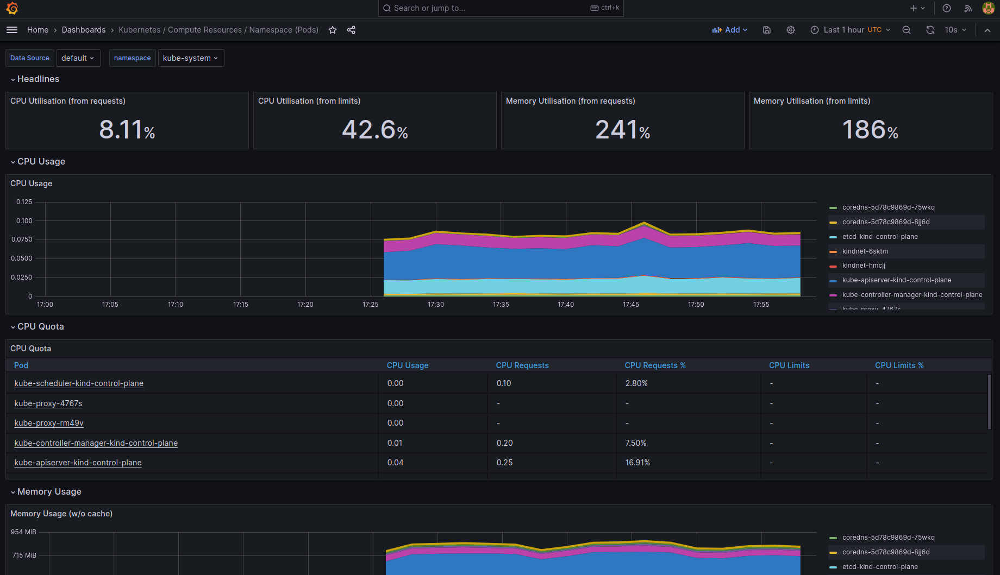

### Step 4: Create the SPIRE Namespaces

In order to install SPIRE with the least privileges possible, we will create two namespaces; `spire-system` & `spire-server`. The purpose behind this structure is to provide a higher degree of separation, and deploy the SPIRE components with the least privileges possible. By doing so, we attempt to emulate a 'production' deployment of SPIRE in a Kubernetes cluster.

To create the `spire-system` namespace, run:

```shell
kubectl create namespace spire-system
```

To create the `spire-server` namespace, run:

```shell
kubectl create namespace spire-server
```

Now, with the two SPIRE namespaces created, we can begin deploying the components via Helm.

### Step 5: Deploy the SPIRE PostgreSQL Data Store

Deploy the SPIRE [PostgreSQL Data Store](https://github.com/spiffe/spire/blob/main/doc/plugin_server_datastore_sql.md#database_type--postgres) by running:

```shell
make deploy-database
```

This will deploy the shared Data Store for our SPIRE Servers by executing the [deploy-database.yaml] manifest, with the expected output:

```log
Deploying the SPIRE PostgreSQL Data Store...

/../../zero-trust-labs/ilt/lab-12-day-two/../bin/kubectl apply -f config/deploy-database.yaml
serviceaccount/spire-db created
statefulset.apps/spire-db created
service/spire-db created
/../../zero-trust-labs/ilt/lab-12-day-two/../bin/kubectl wait --for=condition=Ready --timeout=300s pod -l app=spire-db -n spire-server
pod/spire-db-0 condition met

SPIRE Data Store deployed.
```

Once deployed, you can observe the postgres database logs by running:

```shell
kubectl logs spire-db-0 -n spire-server
```

If it all worked properly, and the database is ready to accept connections, you should see the output:

```log
2023-10-18 21:59:09.278 UTC [1] LOG:  starting PostgreSQL 16.0 (Debian 16.0-1.pgdg120+1) on x86_64-pc-linux-gnu, compiled by gcc (Debian 12.2.0-14) 12.2.0, 64-bit
2023-10-18 21:59:09.278 UTC [1] LOG:  listening on IPv4 address "0.0.0.0", port 5432
2023-10-18 21:59:09.278 UTC [1] LOG:  listening on IPv6 address "::", port 5432
2023-10-18 21:59:09.296 UTC [1] LOG:  listening on Unix socket "/var/run/postgresql/.s.PGSQL.5432"
2023-10-18 21:59:09.321 UTC [70] LOG:  database system was shut down at 2023-10-18 21:59:09 UTC
2023-10-18 21:59:09.330 UTC [1] LOG:  database system is ready to accept connections
```

You are now ready to deploy SPIRE to your cluster.

### Step 6: Deploy SPIRE via Helm

Deploy SPIRE via the official helm chart by running:

```shell
make spire-helm-install
```

Note the expected output:

```log
Installing SPIRE using Helm...

NAME: spire
LAST DEPLOYED: Sat Oct 14 00:22:16 2023
NAMESPACE: default
STATUS: deployed
REVISION: 1
NOTES:
Installed spire…

SPIRE installed using Helm.
```

The `spire-agent` may take a few minutes to start-up, but after all the SPIRE components are shown as running in the `spire-server` and `spire-system` namespaces, you can test if everything is working by running:

```shell
helm test spire
```

Note the expected output:

```log
NAME: spire
LAST DEPLOYED: Thu Oct 19 13:27:37 2023
NAMESPACE: default
STATUS: deployed
REVISION: 1
TEST SUITE:     spire-server-test-connection
Last Started:   Thu Oct 19 13:41:15 2023
Last Completed: Thu Oct 19 13:41:21 2023
Phase:          Succeeded
TEST SUITE:     spire-tornjak-test-connection
Last Started:   Thu Oct 19 13:41:26 2023
Last Completed: Thu Oct 19 13:41:33 2023
Phase:          Succeeded
TEST SUITE:     spire-tornjak-frontend-test-connection
Last Started:   Thu Oct 19 13:41:21 2023
Last Completed: Thu Oct 19 13:41:26 2023
Phase:          Succeeded
NOTES:
Installed spire…
```

Before we move on, however, let's investigate how the provided [values.yaml](./values.yaml) file deploys SPIRE to our cluster. Keep in mind that security configurations are based on K8s [Pod Security Standards](https://kubernetes.io/docs/concepts/security/pod-security-standards/), and the outlined [SPIRE Helm chart production example](https://github.com/spiffe/helm-charts/tree/main/examples/production).

- **global:** This section configures the global SPIRE settings. Here, we've enabled Prometheus telemetry for monitoring and set up `podMonitor`.

```yaml
global:
  telemetry:
    prometheus:
      enabled: true
      podMonitor:
        enabled: true
        namespace: "default"
        labels: {}
  spire:
    clusterName: kind-kind
    trustDomain: coastal-containers.example
    strictMode: true
```

[PodMonitor](https://github.com/prometheus-operator/prometheus-operator/blob/main/Documentation/api.md#podmonitor) is a Prometheus monitoring tool specific to watching Kubernetes pods. The `namespace` declaration defines namespaces which [PodMonitor](https://github.com/prometheus-operator/prometheus-operator/blob/main/Documentation/api.md#podmonitor) can monitor, *other* than those used by SPIRE (`spire-server` & `spire-system`). This is defined to allow for PodMonitor to view our SPIRE workload, which we will deploy to the `default` namespace later on in this demo.

- **spire-server:** Here, we define the the SPIRE Server configurations. Namely, we deploy 3 replicas for high availability via `replicaCount`, the `spire-server` image `version` is set to `1.7.2`, node attestation is done using the [k8sPsat](https://github.com/spiffe/spire/blob/main/doc/plugin_server_nodeattestor_k8s_psat.md) method, and we've specified a service account allow list for our `spire-agent`. The CA subject details are also provided, representing our Coastal Containers Ltd. On top of this, we've configured the shared [PostgreSQL Data Store](https://github.com/spiffe/spire/blob/main/doc/plugin_server_datastore_sql.md#database_type--postgres) within `dataStore.sql`.

```yaml
spire-server:
  image:
    registry: ghcr.io
    repository: spiffe/spire-server
    pullPolicy: IfNotPresent
    version: "1.7.2"
  namespaceOverride: "spire-server"
  replicaCount: 3
  nodeAttestor:
    k8sPsat:
      serviceAccountAllowList: ["spire-system:spire-agent"]
  notifier:
    k8sbundle:
      namespace: spire-system
  ca_subject:
    country: UK
    organization: Coastal Containers Ltd.
    common_name: coastal-containers.example
  dataStore:
    sql:
      databaseType: postgres
      databaseName: spire
      host: spire-db
      port: 5432
      username: spire
      password: coastal-containers
      options:
        - sslmode: disable
  podSecurityContext:
    runAsUser: 1000
    runAsGroup: 1000
    fsGroup: 1000
    fsGroupChangePolicy: OnRootMismatch
  securityContext:
    allowPrivilegeEscalation: false
    runAsNonRoot: true
    readOnlyRootFilesystem: true
    capabilities:
      drop: [ALL]
    seccompProfile:
      type: RuntimeDefault
  tornjak:
    enabled: true
  priorityClassName: system-cluster-critical
  logLevel: info
  controllerManager:
    securityContext:
      allowPrivilegeEscalation: false
      runAsNonRoot: true
      readOnlyRootFilesystem: true
      capabilities:
        drop: [ALL]
      seccompProfile:
        type: RuntimeDefault
    ignoreNamespaces:
      - kube-system
      - kube-public
      - local-path-storage
```

- **spire-agent & upstream-spire-agent:** This section is dedicated to the SPIRE Agent configurations. Namely, we set the `version` to `1.7.2` override the namespace to `spire-system` for the agent, and specified the `spire-server` namespace for the server reference.

```yaml
spire-agent:
  enabled: true
  image:
    registry: ghcr.io
    repository: spiffe/spire-agent
    pullPolicy: IfNotPresent
    version: "1.7.2"
  namespaceOverride: spire-system
  serviceAccount:
    name: spire-agent
  server:
    namespaceOverride: spire-server
  priorityClassName: system-node-critical
  podSecurityContext:
    runAsUser: 1000
    runAsGroup: 1000
    fsGroup: 1000
  securityContext:
    allowPrivilegeEscalation: false
    runAsNonRoot: true
    readOnlyRootFilesystem: true
    capabilities:
      drop: [ALL]
    seccompProfile:
      type: RuntimeDefault
  logLevel: info
```

- **tornjak-frontend:** This segment provides the configuration for the Tornjak management UI for your SPIRE deployment. Here, we provide an `spiServerURL` for the `tornjak-backend` and assign a `ClusterIP` service. We've also overriden the namespace via `namespaceOverride` to deploy in the `spire-server` namespace.

```yaml
tornjak-frontend:
  enabled: true
  nodeSelector: {}
  namespaceOverride: spire-server
  service:
    type: ClusterIP
    port: 3000
  apiServerURL: "http://localhost:10000/"
  podSecurityContext:
    runAsUser: 1000
    runAsGroup: 1000
    fsGroup: 1000
    fsGroupChangePolicy: OnRootMismatch
  securityContext:
    allowPrivilegeEscalation: false
    runAsNonRoot: true
    readOnlyRootFilesystem: false
    capabilities:
      drop: [ALL]
    seccompProfile:
      type: RuntimeDefault
  resources:
    requests:
      cpu: 50m
      memory: 128Mi
    limits:
      cpu: 100m
      memory: 512Mi
```

- **spiffe-csi-driver & upstream-spiffe-csi-driver:** These sections enable the SPIFFE CSI driver in our setup, ensuring seamless integration with Kubernetes workloads as volume mounts.

```yaml
spiffe-csi-driver:
  enabled: true
  namespaceOverride: spire-system
  priorityClassName: system-node-critical
upstream-spiffe-csi-driver:
  namespaceOverride: spire-system
  priorityClassName: system-node-critical
```

- **spiffe-oidc-discovery-provider:** Currently, this segment is currently disabled for our demonstration, but would likely be part of a production environment where you need to connect your `spire-server` to a OIDC provider. Reference the [SPIRE OIDC Discovery Provider](https://github.com/spiffe/spire/blob/main/support/oidc-discovery-provider/README.md) documentation and [lab-9-oidc-discovery](../lab-9-oidc-discovery/) to learn more about how to set this feature up.

```yaml
spiffe-oidc-discovery-provider:
  enabled: false
```

The provided security contexts and priority class names ensure that our SPIRE components are securely deployed with the right privileges and priorities. Again, this is based on the K8s [Pod Security Standards](https://kubernetes.io/docs/concepts/security/pod-security-standards/), which you are highly encouraged to check-out. As we now have a baseline understanding of how SPIRE has been deployed to emulate a production setup, let's access Grafana to monitor your cluster.

## Step 7: Access Grafana Dashboard

In order to access our Grafana dashboard and the Prometheus metrics it hosts, we must first port forward the `prometheus-grafana` service so we can access it on our local browser.

Port forward the `prometheus-grafana` service by running:

```shell
kubectl port-forward svc/prometheus-grafana 8080:80 &
```

*📝Note: This `port-forward` operation will run in the background of your terminal session, per the `&` indicator. As such, connection handling logs will be output to `stdout` in the same terminal, so you will need to hit enter before you issue another command.*

You can now access Grafana at the `localhost:8080` address in your local browser. Once you resolve the `localhost:8080` address, it should prompt you to login. The default login credentials are `username: admin` & `password: prom-operator`. These credentials can be found by examining the `prometheus-grafana` secret and base64 decoding the `admin-password` and `admin-user` K8s secrets.

Once logged into Grafana, you will have access to multiple automatically created dashboards. Given our simple scenario, and the convenient setup of [kube-prometheus-stack](https://github.com/prometheus-community/helm-charts/tree/main/charts/kube-prometheus-stack#kube-prometheus-stack), we can use these pre-created dashboards for our purposes as Prometheus is set as the [Grafana Data Source](https://grafana.com/docs/grafana/latest/datasources/) by default. You can investigate these dashboards by visiting [http://localhost:8080/dashboards](http://localhost:8080/dashboards) and selecting the `General` folder.

For this demonstration, let's focus on the `Kubernetes / Networking / Namespace (Pods)` dashboard to provide us with a convenient location to monitor pod networking metrics relative to the namespaces we've created in our cluster. At the top left of this dashboard, you will notice a `Data Source` and `namespace` drop-down selector, here you can select the `spire-server` & `spire-system` namespaces to monitor how our SPIRE deployment is doing. As this dashboard monitors cluster networking, you will see metrics like:

- Current rate of bytes received & transmitted
- Receive bandwith & transmit bandwith
- Rate of received & transmitted Packets
- Rate of received and transmitted packets dropped
- Current status of your pods

To better showcase this visualization, let's select first the `spire-server` namespace within the `Kubernetes / Networking / Namespace (Pods)` dashboard. You should see something similar to the image provided here:

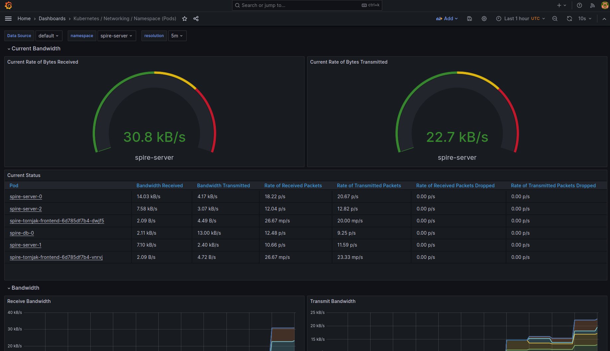

From this pane-of-glass view, you can clearly see the network performance metrics of the various SPIRE components, such as the SPIRE Data Store & Servers running in the `spire-server` namespace.

Next, select the `spire-system` namespace from the `namespace` drop-down. You should now see something similar to the image provided here:

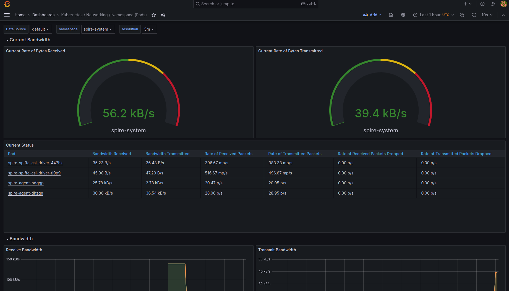

Within this pane-of-glass view, you can see the network performance metrics of the SPIRE Agent and CSI Driver running in the `spire-system` namespace. When analyzed togethor, these metrics help to paint a larger picture about the performance of your SPIRE setup as a whole. You highly encouraged to checkout and play around with other dashboards such as the `Kubernetes / Compute Resources / Namespace (Pods)` which displayes CPU usage related metrics.

### Step 7.2 SPIRE Prometheus Metrics

[//]: # (TODO: complete the documentation here and collect screenshots)

Patching pod monitors and port forwarding to prometheus to show SPIRE specific metrics

```shell
kubectl patch podmonitors.monitoring.coreos.com spire-server \
  --type=merge \
  -p '"spec": {"namespaceSelector": {"matchNames": ["spire-server"]}}'
kubectl patch podmonitors.monitoring.coreos.com spire-agent \
  --type=merge \
  -p '"spec": {"namespaceSelector": {"matchNames": ["spire-system"]}}'
kubectl port-forward svc/prometheus-kube-prometheus-prometheus 9090:9090
```

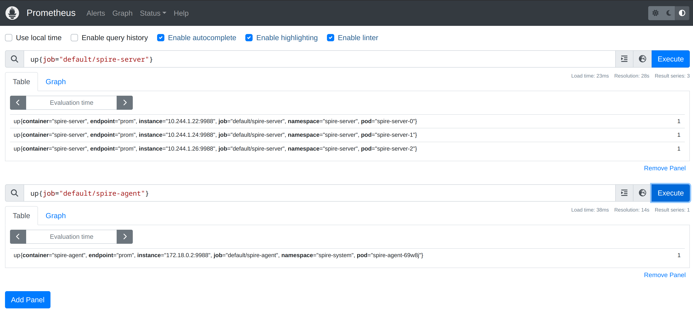


### Step 8: Build and Deploy the Workload

With your monitoring system in place, you can now build and load the SPIRE workload image into the cluster by running:

```shell
make cluster-build-load-image DIR=workload
```

This image is a simple [go-spiffe](https://github.com/spiffe/go-spiffe) workload which watches for received X509-SVIDs and outputs then in [PEM](https://en.wikipedia.org/wiki/Privacy-Enhanced_Mail) format. If you're interested, you can investigate the [workload](./workload/) directory to see how it works in practice with [Go](https://go.dev/).

Now, with the workload image loaded in your cluster, deploy it by running:

```shell
make deploy-workload
```

You should see the expected output:

```shell
Deploying the SPIRE workload...

/../../zero-trust-labs/ilt/lab-12-day-two/../bin/kubectl apply -f config/deploy-workload.yaml
serviceaccount/workload created
deployment.apps/workload created

SPIRE workload deployed.
```

The [deploy-workload.yaml](./config/deploy-workload.yaml) manifest will deploy five instances of the SPIRE workload, which can be seen by running:

```shell
kubectl get pods
```

The output should show the various Prometheus pods & the five workload pods in a `Running` state, as seen here:

```log
NAME                                                     READY   STATUS    RESTARTS   AGE
alertmanager-prometheus-kube-prometheus-alertmanager-0   2/2     Running   0          18h
prometheus-grafana-6fdbffb5c9-pm8qj                      3/3     Running   0          18h
prometheus-kube-prometheus-operator-7f664f74ff-2kdf9     1/1     Running   0          18h
prometheus-kube-state-metrics-898dd9b88-b9w42            1/1     Running   0          18h
prometheus-prometheus-kube-prometheus-prometheus-0       2/2     Running   0          18h
prometheus-prometheus-node-exporter-mt686                1/1     Running   0          18h
prometheus-prometheus-node-exporter-p48hd                1/1     Running   0          18h
workload-676779f6db-8cznw                                1/1     Running   0          31s
workload-676779f6db-8lntk                                1/1     Running   0          31s
workload-676779f6db-tshrs                                1/1     Running   0          31s
workload-676779f6db-w7tmb                                1/1     Running   0          31s
workload-676779f6db-wztw8                                1/1     Running   0          31s
```

These five workload pods will simulate your running applications for the purposes of this demonstration, and should be automatically attested with assigned SPIFFE IDs by the `spire-server` in the `spiffe://coastal-containers.example/ns/{namespace}/sa/{serviceaccount}` URI structure.

Let us now monitor the setup of our running applications in Grafana. To begin, navigate to the `Kubernetes / Compute Resources / Namespace (Pods)` dashboard, and select the `default` namespace from the `namespace` drop-down. You should see a metric visualization similar to the image shown here:

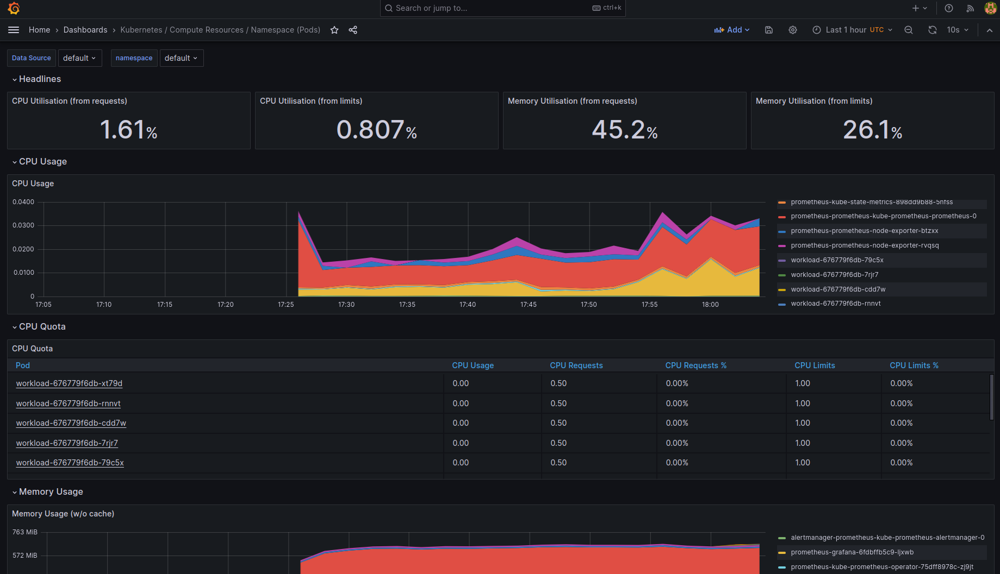

Within this view, you should see CPU and memory metrics for both the running Prometheus pods and your newly deployed workload pods. This visibility is particularly important when running applications at scale, to ensure high availability and mitigate the chances of cluster resource starvation. In the next step, you will learn how to conveniently manage the assigned workload SVIDs within Tornjak.

### Step 9: Access Tornjak UI

To access the Tornjak UI, it needs to be accessible external to the cluster. For the purposes of this demonstration, we are going to `port-foward` the already created tornjak services (`spire-tornjak-frontend` & `spire-tornjak-backend`) to access the UI on your localhost.

First, `port-forward` the `spire-tornjak-backend` service by running:

```shell
kubectl -n spire-server port-forward service/spire-tornjak-backend 10000:10000 &
```

Next, `port-foward` the `spire-tornjak-frontend` service by running:

```shell
kubectl -n spire-server port-forward service/spire-tornjak-frontend 3000:3000 &
```

*📝Note: These `port-forward` operations will run in the background of your terminal session, per the `&` indicator. As such, connection handling logs will be output to `stdout` in the same terminal, so you will need to hit enter before you issue another command.*

Success! The `tornjak-frontend` is now accessible at [http://localhost:3000](http://localhost:3000). View the tornjak dashboard in your browser and notice how you can see your current SPIRE setup, complete with registration entries and verbose config for your various SPIRE components. Tornjak will enable convenient management of your SPIRE components and issued SVIDs. A few key features of Tornjak UI that highlight this are shown below:

- **SPIRE Server Overview:** The [`Tornjak ServerInfo`](http://localhost:3000/tornjak/serverinfo) tab shows information about your running `spire-server`, including the setup `coastal-containers.example` trust domain, loaded plugins such as the `DataStore`, and Verbose Config about your `spire-server`. This tab is particularly useful, as it provides you with a convenient and accessible method to check the specifics of your `spire-server` configuration. See the image below to view the [`Tornjak ServerInfo`](http://localhost:3000/tornjak/serverinfo) page:

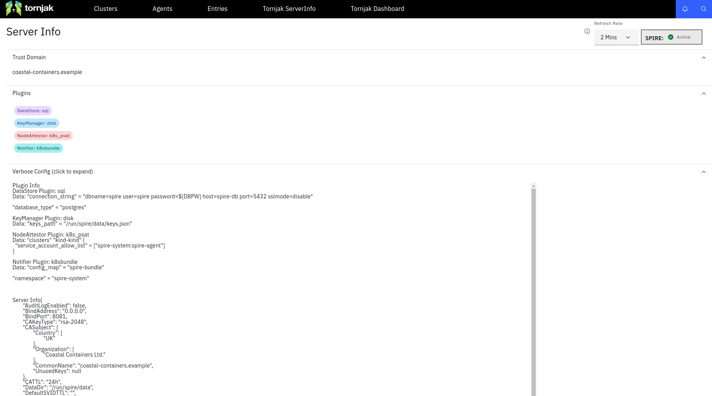

- **Registration Entries:** Navigate to the [`Entries`](http://localhost:3000/entries) tab, and select `Entries List` on the drop-down menu. Here, you can view all the current SVID registration entries, complete with their specific `Id`, `SPIFFE ID`, `Parent ID`, `Selectors`, and associated metadata in JSON format. This functionality is essential for providing visibility over the workloads (and SPIRE Components) that have been issued SVIDs. Furthermore, if you select `Create Entries` in the `Entries` tab drop-down menu, you have the option to create a new registration entry by either submitting the custom entry form or uploading a JSON file. The JSON format for this submission should adhere to the template shown in the [newEntry-json-format.md](https://github.com/mamy-CS/tornjak-public/blob/create-entries-yaml/docs/newEntry-json-format.md) file on the Tornjak docs. See the image below to view the [`Entries`](http://localhost:3000/entries) page:

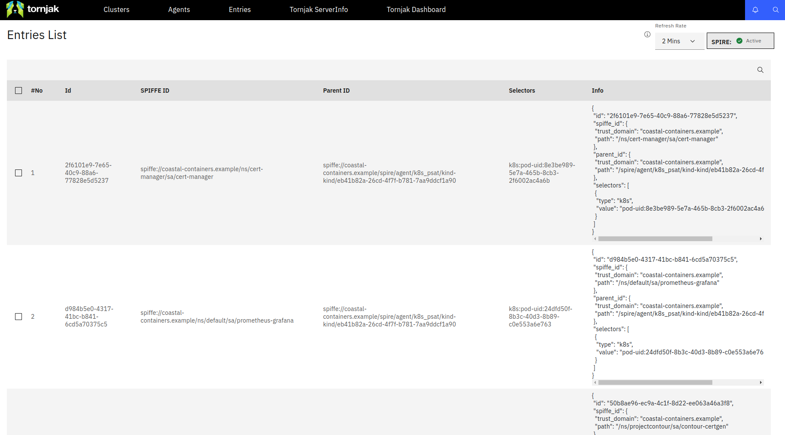

- **Agents:** Navigating to the [`Agents`](http://localhost:3000/agents) tab, click on the `Agents List` option in the drop-down menu. This page provides a list of all `spire-agent` components connected to the `spire-server`, and includes key associative information such as their `Trust Domain`, `SPIFFE ID`, `Workload Attestor Plugin`, and metadata outputted in JSON format. Within this page, you can optionally delete or even ban `spire-agent` components in the case of malfunction or a security incident such as a [confused deputy attack](https://en.wikipedia.org/wiki/Confused_deputy_problem). Hovering over the `Agents` tab once more, click on the [`Create Token`](http://localhost:3000/agent/createjointoken) option in the drop-down menu. Within this page, you have the option to create a [Join Token](https://spiffe.io/docs/latest/deploying/configuring/#join-token), which will attest a `spire-server` to a `spire-agent` using a single-use token. If you're interested, you can reference [lab-2-binary-install](https://github.com/controlplaneio/zero-trust-labs/tree/main/ilt/lab-2-binary-install) to see how we use a join token to attest the provided `spire-agent` attestation to the `spire-server` within a local SPIRE binary setup. See the image below to view the [`Agents`](http://localhost:3000/agents) tab:

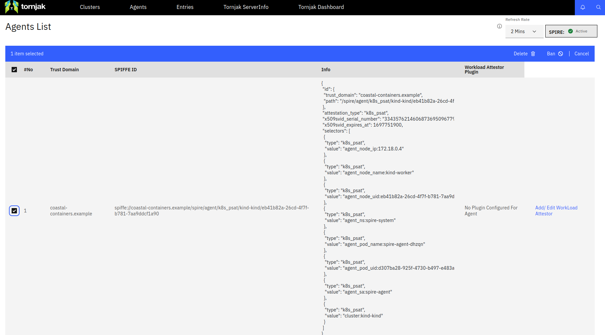

Additionally, reference the image below to see the [`Create Token`](http://localhost:3000/agent/createjointoken) page:

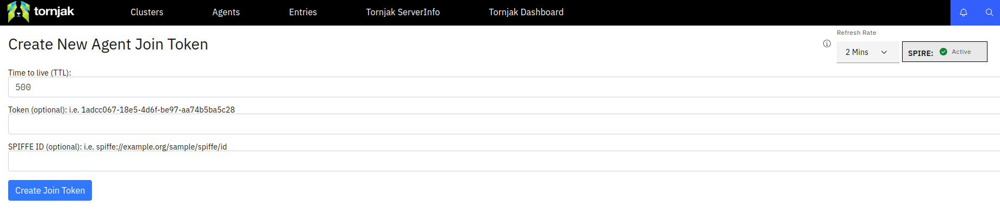

- **Tornjak Dashboard:** Finally, a key functionality of Tornjak is providing a comprehensive dashboard which tracks the primary SPIRE components and cluster infrastructure within a single pane-of-glass view. This dashboard can be conveniently accessed on the [`Tornjak Dashboard`](http://localhost:3000/tornjak/dashboard) tab, which shows metrics such as:

  - the number of agents per cluster
  - the number of workloads per agent
  - a list of running agents
  - the current list of issued registration entries

Reference the image below to see how the [`Tornjak Dashboard`](http://localhost:3000/tornjak/dashboard) displays the current SPIRE Agents and registration entries in a convenient manner:

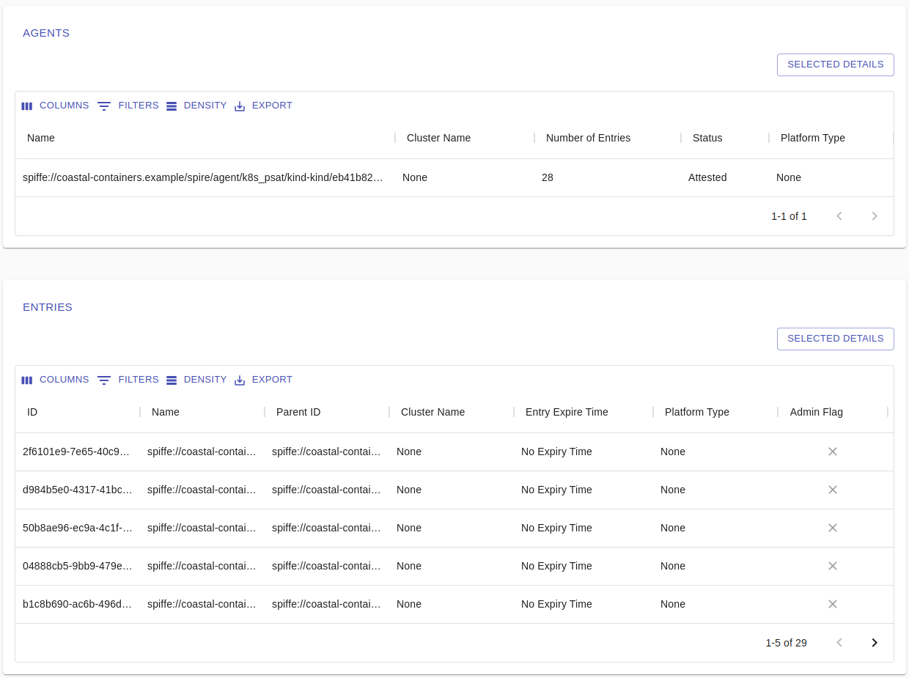

With the functionality of Tornjak in mind, you can begin to see how it provides accessible and convenient features for SPIRE management in "Day Two" operations as an integrated UI layer. For more information about Tornjak, you're encouraged to checkout the [spiffe/tornjak GitHub repository](https://github.com/spiffe/tornjak).

### Step 10: Keeping SPIRE Running

That's it for the setup of our scenario! As it currently stands, you have created:

- a SPIRE deployment running on the `spire-server` and `spire-system` namespaces, which runs with recommended 'production' configurations based on the [SPIRE Production Helm Chart Example](https://github.com/spiffe/helm-charts/tree/main/examples/production).
- a Grafana dashboard using Prometheus metrics, which is accessible on [`localhost:8080`](http://localhost:8080). This is deployed via the [kube-prometheus-stack](https://github.com/prometheus-community/helm-charts/tree/main/charts/kube-prometheus-stack#kube-prometheus-stack) Helm chart.
- a Tornjak UI to manage your SPIRE deployment, which is accessible on [`localhost:3000`](http://localhost:3000). This is configured via the provided [values.yaml](./values.yaml) deployed through the [spire Helm chart](https://github.com/spiffe/helm-charts/tree/main/charts/spire).
- a simple SPIRE workload setup, which consists of five pods in a K8s deployment. These workload pods operate based on a custom [go-spiffe](https://github.com/spiffe/go-spiffe) Docker image that watches for X509-SVID updates.

🌅The seabirds call as the sun now dawns on the dreaded **Day Two**, where you are tasked by the concerned captains of Coastal Containers⚓ to keep their ships afloat by maintaining and managing your running SPIRE deployment post-setup. To teach ye how to sail the high seas, we will guide you through three scenarios that ye may encounter on **Day Two** sailing the opean sea:

- **Upgrade and Downgrade SPIRE:** Demonstrating expected maintenance operations to properly update your SPIRE deployment, you will run through a simple exercise using `helm` to first downgrade and then upgrade SPIRE back to version `1.8.0`. This aims to emulate a scenario where you need to either upgrade SPIRE to a new release version, or downgrade it due to compatibility issues within your production environment.

- **Disaster Recovery:** Accounting for the worst-case scenario, you will need to recover your SPIRE setup after a compromise to availability. For the purposes of this demonstration, you will be running a destructive `make` command that takes down your `spire-server` instances.

- **Key Material Compromise:** Representing a potential security breach, where a malicious actor compromises the `spire-server` signing keys, you will need to take remediary action to mitigate the damage done and ensure continued secure operation of SPIRE's identity mechanisms.

#### Upgrade and Downgrade SPIRE

Oi captain, tha' ship crew would like to have a word with ye 👨‍🔧! Coastal Containers boasts a fine fleet of sea-worthy vessels, but no ship can withstand the sea for long without the right fixin'🛠. To keep their freighters a'float, the ship crew performs regular maintenance to upgrade and downgrade parts needin' replacing.

In this section, we will walk you through how to perform upgrades and downgrades to SPIRE, but before we get into the demonstration, you must first understand how SPIRE handles versioning and compatibility. We will provide a basic breakdown of this, but you are encouraged to check-out the official [Managing Upgrades/Downgrades](https://spiffe.io/docs/latest/maintenance/upgrading/) page of the SPIFFE docs, where a detailed outline of this material can be found.

- **SPIRE versioning:** SPIRE follows [Semantic Versioning](https://semver.org/), represented as `x.y.z`:

  - `x`: Major version

  - `y`: Minor version

  - `z`: Patch version

*📝Note: Versions prior to `0.12.0` are not compatible with `1.0.x` However, `0.12.x` versions are an exception and have compatibility with `1.0.x` versions.*

- **Server Compatibility:**

  - SPIRE Server supports version skew within +/- 1 minor version.
  - The newest and oldest SPIRE Server instances in a cluster must be within one minor version of each other.
  - Versions `0.12.x` are compatible with `1.0.x` versions.

- **SPIRE Agent Compatibility:**

  - SPIRE Agents must not be newer than the oldest SPIRE Server they communicate with.
  - Agents can be up to one minor version older.
  - SPIRE Agent versions `0.12.x` are compatible with SPIRE Server versions `1.0.x.`

- **SPIRE Plugin Compatibility:**

  - Built-in plugins maintain backwards compatibility for one minor version after a backwards incompatible change.
  - External plugins' compatibility is not guaranteed by SPIRE.
  - Breaking changes to a plugin interface will still function for one minor version release cycle.

- **Supported Upgrade Paths:**

  - SPIRE Servers must be upgraded before SPIRE Agents.
  - Upgrades are limited to a jump of at most one minor version.
  - SPIRE Server and agent instances can be upgraded in a rolling fashion.
  - SPIRE Server supports zero-downtime upgrades with more than one SPIRE Server in the cluster.

- **Supported Downgrade Paths:**

  - Downgrade agents before downgrading servers if agents have been upgraded.
  - SPIRE Server and agent instances can be upgraded in a rolling fashion, so long as the above sequence (server, then agent) and version difference is applied.

With preliminary information out of the way, performing upgrade and downgrade operations with your SPIRE deployment is made easy through the `helm` cli. To demonstrate this process, we will first begin by running through an upgrade from the current `1.7.2` version to `1.8.0`, and then performing an downgrade to get SPIRE back to the original `1.7.2` version.

To upgrade your `spire-server` and `spire-agent` to `1.8.0`, run the following `helm upgrade` command:

```shell
helm upgrade spire spiffe/spire --reuse-values --set spire-server.image.version=1.8.0 --set spire-agent.image.version=1.8.0
```

Note the expected output:

```log
Release "spire" has been upgraded. Happy Helming!
NAME: spire
LAST DEPLOYED: Wed Oct 18 20:04:13 2023
NAMESPACE: default
STATUS: deployed
REVISION: 2
NOTES:
Installed spire…
```

With this simple `helm upgrade` command, you've first upgraded your `spire-server` and `spire-agent` to version `1.8.0`. Keep in mind that you need to pass the `--reuse-values` command, or the rest of your [values.yaml](./values.yaml) configuration will not be reused in the new release created via `helm upgrade`.

In order to test that the upgrade was successful, and your SPIRE components are running on version `1.8.0`, first run:

```shell
helm test spire
```

If the upgrade was successful, and SPIRE is running, you should see the expected output:

```log
NAME: spire
LAST DEPLOYED: Thu Oct 19 17:28:06 2023
NAMESPACE: default
STATUS: deployed
REVISION: 2
TEST SUITE:     spire-server-test-connection
Last Started:   Thu Oct 19 17:29:15 2023
Last Completed: Thu Oct 19 17:29:19 2023
Phase:          Succeeded
TEST SUITE:     spire-tornjak-test-connection
Last Started:   Thu Oct 19 17:29:24 2023
Last Completed: Thu Oct 19 17:29:31 2023
Phase:          Succeeded
TEST SUITE:     spire-tornjak-frontend-test-connection
Last Started:   Thu Oct 19 17:29:19 2023
Last Completed: Thu Oct 19 17:29:24 2023
Phase:          Succeeded
NOTES:
Installed spire…
```

Optionally, you can also inspect the `spire-server` and `spire-agent` pods themselves to ensure they are running with the version `1.8.0`. Let's first check the `spire-server` by running:

```shell
kubectl describe pod spire-server-0 -n spire-server
```

This will output the pod configuration for the running `spire-server-0` pod, and you should see the new `1.8.0` image set via the `Image: ghcr.io/spiffe/spire-server:1.8.0` stanza. Now let's check the `spire-agent` by running:

```shell
kubectl describe pod spire-agent-#### -n spire-server
```

This will output the pod configuration for the running `spire-agent-####` pod, and you should see the new `1.8.0` image set via the `Image: ghcr.io/spiffe/spire-agent:1.8.0` stanza. Keep in mind that the trailing four characters (`####`) needs to match those shown on the name of your running `spire-agent` pod. You've now successfully upgraded your SPIRE deployment, now we will begin the downgrade process back to version `1.7.2`.

To downgrade your `spire-server` and `spire-agent` back to `1.7.2`, we have a number of options. The first is running a `helm rollback` to the previous release, as shown here:

```shell
helm rollback spire 1
```

Note the expected output:

```log
Rollback was a success! Happy Helming!
```

This command rolls back your SPIRE deployment to the original release state which was deployed when you first ran `make spire-helm-install`. The `1` in this command represents the helm `[RELEASE]`, and `spire` represents the helm `[CHART]`. Although this is easy to execute, it doesn't account for more nuanced use-case requirements where you may want to downgrade to a different version than in the original `[RELEASE]`, or have differing versions that may present compatibility issues. In this case, you can run a similar command as shown previously, which uses `helm upgrade`.

To downgrade your `spire-server` and `spire-agent` back to version `1.7.2` with `helm upgrade`, run the command:

```shell
helm upgrade spire spiffe/spire --reuse-values --set spire-server.image.version=1.7.2 --set spire-agent.image.version=1.7.2
```

Note the expected outcome:

```log
Release "spire" has been upgraded. Happy Helming!
NAME: spire
LAST DEPLOYED: Thu Oct 19 17:51:36 2023
NAMESPACE: default
STATUS: deployed
REVISION: 3
NOTES:
Installed spire…
```

Once complete, your SPIRE depoyment will have three revisions. One from originally deploying SPIRE, the second from upgrading it to version `1.8.0`, and the third from downgrading it back to version `1.7.2`. You can easily view the currently installed helm charts, their revisions, and more using the `helm list` command. Before we move on, however, let's test that this operation was successful.

In order to test that the downgrade worked as expected, and your SPIRE components are now running on version `1.7.2`, first run:

```shell
helm test spire
```

If the downgrade was successful, and SPIRE is running, you should see the expected output:

```log
NAME: spire
LAST DEPLOYED: Thu Oct 19 17:51:36 2023
NAMESPACE: default
STATUS: deployed
REVISION: 3
TEST SUITE:     spire-server-test-connection
Last Started:   Thu Oct 19 17:54:37 2023
Last Completed: Thu Oct 19 17:54:46 2023
Phase:          Succeeded
TEST SUITE:     spire-tornjak-test-connection
Last Started:   Thu Oct 19 17:54:55 2023
Last Completed: Thu Oct 19 17:55:01 2023
Phase:          Succeeded
TEST SUITE:     spire-tornjak-frontend-test-connection
Last Started:   Thu Oct 19 17:54:46 2023
Last Completed: Thu Oct 19 17:54:54 2023
Phase:          Succeeded
NOTES:
Installed spire…
```

Well done cap'n! You've successfully upgraded and downgraded your `spire-server` & `spire-agent` using `helm`! Keep in mind that in more complex or distributed setups, where you may have SPIRE Servers and Agents running on different versions, you should closely adhere to the official [Managing Upgrades/Downgrades](https://spiffe.io/docs/latest/maintenance/upgrading/) guide as to mitigate compatibility issues and downtime.

#### Disaster Recovery

🌀⚡Arrrgh, matey, thar she blows! Batten down the hatches, we're in for a blow! 🌀⚡ A malevolent maelstrom blows in from sea and wipes out the luminating lighthouse's of your fleet, the SPIRE Servers... What can ye do to avoid sure sinkin', and ensure Coastal Containers ships find er' way through the rocky coast?

To simulate worst-case scenario's, we will be deleting your `spire-server` instances to showcase what can be done to recover the availability your SPIRE deployment and issued SVIDs. Before we begin this exercice, however, it's important to note, that in the case of SPIRE downtime, your main concern should be the continued issuance of SVIDs to workloads that need them in order to operate. Luckily for us, the SPIRE Agent's in-memory SVID cache is designed to protect against short-term outages. Specifically, the SPIRE Agent will continue to deliver cached SVIDs that it already fetched from the SPIRE Server even if the server were to go down as this process is done in advance of any request for an SVID from a workload. Through the SVID cache, your `spire-agent` avoids the need to make a round trip to the `spire-server` as it already has the authorized SVIDs cached in-memory.

*📝Note: There is a key distinction between how the `spire-agent` handles X509-SVIDs and JWT-SVIDs in this manner, as JWT-SVIDs cannot be minted in advance given the `spire-agent` does not yet know the audience claim needed by the requesting workload. Despite this, the agent still maintains a cache of issued JWT-SVIDs, thereby allowing it to issue cached JWT-SVIDS without contacting the `spire-server` as long as they're still valid.*

The specific `time-to-live` or `TTL` of issued SVIDs is an important attribute to consider when it comes to outages and disaster recovery. This is primarily because the longer the `TTL`, the longer you have to recover from an outage before it impacts your running workloads. As such, you should thoughtfully consider the right `TTL` for issued SVIDs as arbitrarily increasing it may introduce risks of unnecessary exposure and potential [replay attack](https://csrc.nist.gov/glossary/term/replay_attack). As there isn't a silver bullet to determining the right `time-to-live`, it should be carefully considered and weighed against the risks of both availability disruptions and potential attack vectors introduced by long-lived authentication tokens.

To begin our first scenario, run the following `kubectl` command to delete one of your `spire-server` instances within the deployed [StatefulSet](https://kubernetes.io/docs/concepts/workloads/controllers/statefulset/):

```shell
kubectl delete pod spire-server-2 -n spire-server
```

Once you've ran `kubectl delete`, issue the following `kubectl get` command to see the terminated `spire-server-2` pod:

```shell
kubectl get pods -n spire-server
```

You should see an output showing that only `2/3` of your `spire-server-2` instances are running, as shown here:

```log
NAME                                      READY   STATUS      RESTARTS   AGE
spire-db-0                                1/1     Running     0          8m30s
spire-server-0                            3/3     Running     0          5m12s
spire-server-1                            3/3     Running     0          4m47s
spire-server-2                            2/3     Running     0          11s
```

Due to the nature of Kubernetes [StatefulSets](https://kubernetes.io/docs/concepts/workloads/controllers/statefulset/), however, a new `spire-server-2` pod will automatically be spun up to achieve the desired state of `3/3` running instances. This is a good thing, especially when one or more single instances of your SPIRE Servers go down, as Kubernetes will automatically re-deploy new pods to meet the desired state and reduce the chance of downtime. Let's now move on to a more troubling example of disaster striking your SPIRE Server deployment, where they are all deleted.

To simulate this scenario, run the folowing `kubectl` command to entirely delete all of your running `spire-server` instances:

```shell
kubectl delete statefulset spire-server -n spire-server
```

Once you've ran `kubectl delete`, issue the following `kubectl get` command to view the terminated `spire-server` pods:

```shell
kubectl get pods -n spire-server
```

You should notice that none of your previously running `spire-server` instances are available in the output, as shown here:

```log
NAME                                      READY   STATUS      RESTARTS   AGE
spire-db-0                                1/1     Running     0          16m
spire-server-test-connection              0/1     Completed   0          11m
spire-tornjak-frontend-6d785df7b4-l5mf4   1/1     Running     0          13m
spire-tornjak-frontend-test-connection    0/1     Completed   0          11m
spire-tornjak-test-connection             0/2     Completed   0          11m
```

To further investigate the impact of this, analyze the logs of your running `spire-agent` by running:

```shell
kubectl logs -f -l=app.kubernetes.io/name=agent -n spire-system
```

```log
time="2023-10-23T19:20:43Z" level=info msg="Renewing X509-SVID" entry_id=f6ac02f9-f459-4c9d-801c-8f40ba22dd5a spiffe_id="spiffe://coastal-containers.example/ns/default/sa/workload" subsystem_name=manager
time="2023-10-23T19:20:43Z" level=info msg="Renewing X509-SVID" entry_id=c64467eb-3d8b-4e79-a700-4998bb4726e0 spiffe_id="spiffe://coastal-containers.example/ns/default/sa/workload" subsystem_name=manager
time="2023-10-23T19:20:43Z" level=info msg="Renewing X509-SVID" entry_id=eaefe8ff-924a-47ec-8f17-45aec3f6068b spiffe_id="spiffe://coastal-containers.example/ns/default/sa/workload" subsystem_name=manager
time="2023-10-23T19:20:43Z" level=info msg="Renewing X509-SVID" entry_id=1627ff02-3737-4716-a216-8c995e5cfc14 spiffe_id="spiffe://coastal-containers.example/ns/default/sa/workload" subsystem_name=manager
time="2023-10-23T19:20:43Z" level=info msg="Renewing X509-SVID" entry_id=f6200550-e45b-4d7b-a48e-aa06bc59545b spiffe_id="spiffe://coastal-containers.example/ns/default/sa/workload" subsystem_name=manager
time="2023-10-23T19:21:27Z" level=error msg="Failed to fetch authorized entries" error="rpc error: code = Unavailable desc = last connection error: connection error: desc = \"transport: error while dialing: dial tcp 10.96.140.28:8081: connect: connection refused\"" subsystem_name=manager
time="2023-10-23T19:21:27Z" level=error msg="Synchronize failed" error="failed to fetch authorized entries: rpc error: code = Unavailable desc = last connection error: connection error: desc = \"transport: error while dialing: dial tcp 10.96.140.28:8081: connect: connection refused\"" subsystem_name=manager
time="2023-10-23T19:21:34Z" level=error msg="Synchronize failed" error="failed to dial dns:///spire-server.spire-server:8081: connection error: desc = \"transport: error while dialing: dial tcp 10.96.140.28:8081: connect: connection refused\"" subsystem_name=manager
time="2023-10-23T19:21:45Z" level=error msg="Synchronize failed" error="failed to dial dns:///spire-server.spire-server:8081: connection error: desc = \"transport: error while dialing: dial tcp 10.96.140.28:8081: connect: connection refused\"" subsystem_name=manager
```

This output clearly shows that the `spire-server` can no longer be reached as it has been deleted in our case. While not good by any means, the in-memory SVID cache for the `spire-agent` will buy us some time to get everything up and running again. The easiest way to get your `spire-server` instances running again is to use a `helm rollback`, this will effectively re-deploy the missing `spire-server` pods to achieve the original desired state of your SPIRE deployment.

To do so, run the following command:

```shell
helm rollback spire 1
```

Once this operation finishes, you should be able to see the running `spire-server` pods again. Checking the `spire-agent` logs will reveal that the `spire-server` SVIDs have been successfully renewed after they're re-deployed to the cluster. Well done captain, you've averted sure disaster and recovered your SPIRE Servers after downtime! Keep in mind, however, that this isn't a catch all solution to disaster recovery, as you may need scheduled restore points or more consistent backups of your cluster resources. In a more complex case such as this, you should consider using tooling such as [Velero](https://velero.io/docs/v1.12/), which is an open-source K8s tool that lets you easily backup and restore cluster resources. It can work easily with helm, and operates based on a running server on your cluster and a local command-line interface (CLI). For more information about using Velero for disaster recovery, reference the [Disaster recovery](https://velero.io/docs/v1.12/disaster-case/) documentation on their official site.

#### Key Material Compromise

Pirates are on the horizon!🏴‍☠️ After noticing a suspicious pod deployment and registration entry, you begin to suspect key material compromise... What can you do in the face of such dastardly deeds?

To simulate key material compromise, you will run a `make` command which creates a 'malicious' deployment (`pirate-ship`) to your Kubernetes cluster in the newly created `pirate-coast` namespace.

```shell
make deploy-malicious
```

Functionally, this deployment exposes a nginx server over a `NodePort` service, which should not have been deployed to your cluster. Checking the Tornjak UI, under the `Entries List` dashboard, you will see a new SPIFFE ID (`spiffe://coastal-containers.example/ns/pirate-coast/sa/pirate-ship`) assigned to this malicious workload. This represents our key material compromise scenario, where a threat actor uses stolen `spire-server` signing keys to authenticate a malicious workload on the cluster. Now, keep in mind, that this is just for demonstration purposes as we abstract away the actual attack chains needed to pull this dastardly feat off.

For now, you've just noticed an unrecognized SVID, which indicates a potential key material compromise. Having monitored the unusual pod activity on Grafana, and inspected the SPIFFE ID on Tornjak, swift action needs to be taken to remediate this by removing the malicious workload and rotating the `spire-server` signing keys.

First, contain and delete the malicious workload in your cluster. We'll simplify this operation by running:

```shell
make delete-malicious
```

Effectively, this command will `kubectl delete` the malicious `pirate-server` deployment and the associated `NodePort` service. You should see the expected output:

```log
Purging the pirates from the cluster coast...

/../../zero-trust-labs/ilt/lab-12-day-two/../bin/kubectl delete -f config/deploy-malicious.yaml
namespace "pirate-coast" deleted
serviceaccount "pirate-ship" deleted
deployment.apps "pirate-ship" deleted
service "pirate-ship" deleted

The coast is clear!
```

What can you do next? Currently, SPIRE does not support a Key Management API, from where you could forcibly rotate the
signing keys and propagate updates to the
[SPIRE Trust Bundle](https://spiffe.io/docs/latest/spiffe-about/spiffe-concepts/#trust-bundle). The need for this
functionality is present and remains a work in progress tracked on the
[Force rotation and bundle revocation](https://github.com/orgs/spiffe/projects/21) GitHub project, along with the open
[RFC Forced Rotation and Revocation](https://github.com/spiffe/spire/issues/1934) issue. In an ideal scenario, this
process would look like:

- **Step One, Prepare a New Signing Key:** Generate a new signing key and inject it into the trust bundle.
- **Step Two, Activate the New Signing Key:** Move signing operations away from the old key and to the newly generated
key.
- **Step Three, Signal an Impending Key Revocation:** Distribute notice of impending key revocation to impacted agents
and workloads, so they can transit their key validation paths to the newly generated key.
- **Step Four, Revoke the Compromised Key:** Remove the old key from the trust bundle and propagate the change
downstream.

For the time being, however, we have a few options with the bundle management API using the
[spire-server cli](https://github.com/spiffe/spire/tree/main/cmd/spire-server/cli). Some rudimentary, CRUD-like commands
for the cli include those shown below.

To display the current registration entries, run:

```shell
kubectl exec -n spire-server spire-server-0 -- /opt/spire/bin/spire-server entry show
```

To delete the a registration entry, run:

```shell
kubectl exec -n spire-server spire-server-0 -- /opt/spire/bin/spire-server entry delete <entry-id>
```

To display the current trust bundle, run:

```shell
kubectl exec -n spire-server spire-server-0 -- /opt/spire/bin/spire-server bundle show
```

To create a new trust bundle, run:

```shell
kubectl exec -n spire-server spire-server-0 -- /opt/spire/bin/spire-server bundle set
```

To delete the current trust bundle, run:

```shell
kubectl exec -n spire-server spire-server-0 -- /opt/spire/bin/spire-server bundle delete
```

The present gap within the current functionality is that trust bundles are public material, and there isn't a
streamlined way to manage the keys that represent them. Given the lack of interfaces to perform these functions, there
is discretion as to how forced rotation and revocation should occur within SPIRE deployments. Production environments
will likely offload these tasks to provider-specific tooling like
[AWS Key Management Service](https://aws.amazon.com/kms/) or
[GCP Cloud Key Management](https://cloud.google.com/security-key-management), however, these solutions are beyond the
scope of this course.

### Step 11: Cleanup

As some of the other lab exercises use the same cluster, you can uninstall SPIRE / Prometheus using helm and tear down
the workload deployments from this lab by running:

```shell
cd $LAB_DIR && make spire-helm-uninstall prometheus-helm-uninstall
make tear-down
```

To tear down the entire Kind cluster, run:

```shell
cd $LAB_DIR && make cluster-down
```

## Conclusion

Congratulations, Captain! 🚢 You've successfully navigated the vast seas of SPIRE's day two operations. Through this
journey, you've gained insights into monitoring, managing, and ensuring the resilience of your SPIRE deployment. By
leveraging tools like [Prometheus](https://prometheus.io/), [Grafana](https://grafana.com/), and
[Tornjak](https://github.com/spiffe/tornjak), you've equipped yourself with the skills to keep a vigilant eye on your
SPIRE setup, ensuring its smooth sailing even in turbulent waters. As you continue your voyage in the world of SPIFFE
and SPIRE, remember the lessons from this lab, and always be prepared for the challenges that lie ahead. Safe travels!
🌊
